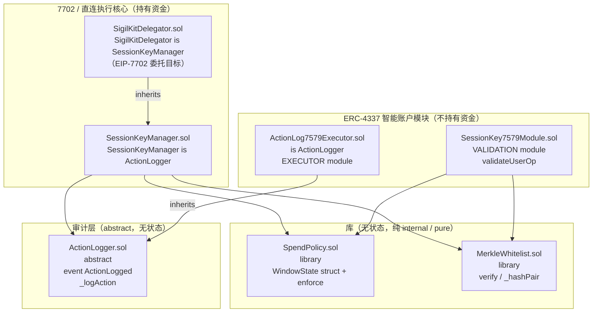
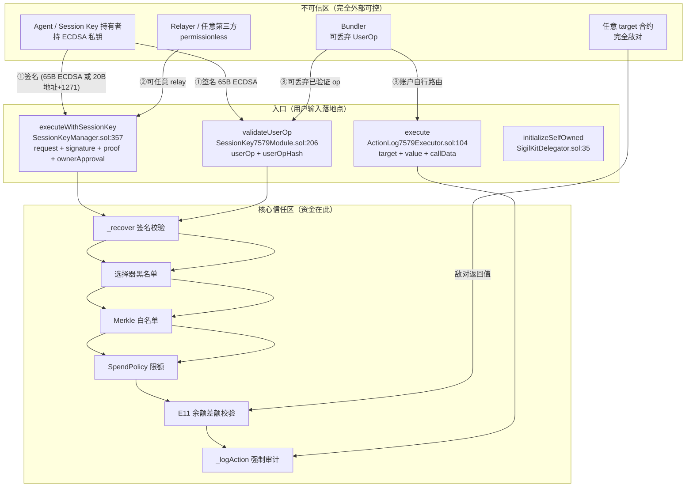

# ARCH-CONTRACTS-2026-09-26

**SigilKit `contracts/src` 架构、可升级性与规范符合性审计**

范围：`d:/SigilKit/contracts/src/*.sol`（7 个文件）。本文件是本轮唯一交付物，
面向**第一次接触本代码库的新工程师**，读完能理解整体结构、存储布局与升级风险。

> 🔴 **交付状态（阅读前必知）**
>
> **本文档及其所述的全部代码改动目前只存在于工作区，尚未进入 git 历史。**
> `forge test` 的 **224 passed / 0 failed** 是**工作区**基线，**不是已交付基线**。
> 已核实：`SessionKeyManager.sol` / `SpendPolicy.sol` 为 ` M`（我的改动未进历史），
> `Sec10WindowRotation.t.sol` 与本文档为 `??`（从未提交）。
>
> **「文件曾被提交过」≠「我的改动已进历史」**——判断依据是
> `git show HEAD:<file>` 是否含我的符号。详见 **§E.8**。
>
> **在提交前，请勿把本文档的任何行号引用写入收口文档**——行号会随提交后的 diff 再次漂移。

---

## 0. 阅读顺序建议

1. 第 1 节 组件图（谁依赖谁）
2. 第 2 节 信任边界图（用户可控输入进入信任边界的位置）
3. 第 3 节 存储布局表 **（最关键：升级兼容性结论）**
4. 第 4 节 EIP-7702 / ERC-2535 / ERC-7579 / ERC-4337 核对结论
5. 第 5 节 架构债清单（分级 + 修法选项）
6. 第 6 节 给新工程师的"如果我要改 X，该看哪里"

---

## 1. 组件图

### 1.1 继承 / 组合关系



### 1.2 关键结论：**零 delegatecall**

全仓库 `contracts/src` 内 **没有任何 `delegatecall` 字面量**（已 grep 验证：
仅 5 处 `assembly` 块，全部是 storage-slot 绑定或 `revert` 冒泡，无 delegatecall）。

| 项 | 结论 |
|---|---|
| 显式 `delegatecall` | **0 处** |
| 代理合约（Proxy） | **0 个**（`src/` 下无任何 proxy 合约） |
| 合约间调用 | 只有 `CALL`（`SessionKeyManager._interact`、`ActionLog7579Executor.execute`、`withdraw`、`_erc20BalanceOf`、`_recover` 里的 ERC-1271 `staticcall`） |
| 继承（Solidity 机制，非 delegatecall） | `SigilKitDelegator → SessionKeyManager → ActionLogger`；`ActionLog7579Executor → ActionLogger` |

**这意味着经典的"delegatecall 存储冲突"风险在本仓库当前形态下不存在**——
因为不存在共享 storage 的 delegatecall 边界。真正的共享 storage 风险来自
**EIP-7702**（EOA 用自己的 storage 跑 `SigilKitDelegator` 代码），见第 3 节。

### 1.3 delegatecall 等价物：EIP-7702 隐式存储共享

EIP-7702 的执行语义**等价于一次隐式 delegatecall**：EOA 的 code 变成
`0xef0100 || delegator地址`，所有 `CALL` 到该 EOA 时，EVM 加载 delegator 的 code
但用 **EOA 自己的 storage** 执行。这条路径是本仓库**唯一**的存储共享面，
其安全性由 ERC-7201 命名空间保证（见 3.3）。

### 1.4 两条互斥的执行路径

设计上刻意做成**二选一**，不要试图把它们拼在一起：

| | 路径 A：7702 原生 EOA | 路径 B：ERC-4337 智能账户 |
|---|---|---|
| 部署物 | `SigilKitDelegator`（EOA 委托目标） | 外部账户（Kernel / Safe{Core}） |
| 模块 | 无（EOA 自己就是账户） | `SessionKey7579Module` + `ActionLog7579Executor` |
| 授权 | EIP-712 `ActionRequest` + session key 签名 | ERC-4337 `userOpHash` + session key 签名 |
| 执行入口 | `executeWithSessionKey`（permissionless relay） | EntryPoint → 账户 → executor |
| 资金来源 | EOA 自身余额（`receive()` 充值） | 账户的 EntryPoint deposit |
| 审计事件 | `ActionLogged`（路径 A 必发） | 路径 B 的 **validator 不发**，由 executor 发 |
| ERC-7201 槽 | `...SessionKeyManager` | `...SessionKey7579Module` |

---

## 2. 信任边界图

### 2.1 边界总览



### 2.2 逐个用户可控输入 → 信任边界穿越点

这是本节的核心：**每一个外部可控的字节，在哪里第一次被"完全信任"之前必须被检查**。

#### 边界 ①：`SessionKeyManager.executeWithSessionKey`（路径 A 唯一无许可入口）

| # | 用户可控输入 | 校验位置 | 校验内容 | 未校验会怎样 |
|---|---|---|---|---|
| 1.1 | `signature` | `_recover` :637 | 65B 走 ECDSA；否则取前 20B 当 `keyContract`、要求 `extcodesize != 0`、1271 staticcall、**且返回值必须是裸 magic 或全 0 尾的完整 ABI word**（`_isERC1271SuccessMagic` :614，SEC-11 修复） | 伪造 signer → 越权 |
| 1.2 | `signer` | :370-371 | `scope.expiresAt != 0`（KeyUnknown）+ `!revoked[signer]` | 用不存在的 key 执行 |
| 1.3 | `block.timestamp` vs `scope.expiresAt` / `request.expiry` | :377, :379 | 双重过期检查 | key 过期后仍可用 |
| 1.4 | `request.value` vs `scope.countersignAbove` | :382-394 | 超过阈值且 `signer != owner` 时**必须**有 owner 的 EIP-712 `RequestApproval` 反签名 | 大额动作无需 owner 背书 |
| 1.5 | `request.nonce` | :398-399 | **必须严格等于** `s.nonces[signer]`（顺序 nonce，非"大于"），先写 effect 再交互 | 重放 / nonce 跳跃 |
| 1.6 | `request.selector` | :402 | `ownerOnlySelectors[selector]` 黑名单 | 借 allow-all 白名单的 key 打 admin 面 |
| 1.7 | `request.target` + `request.selector` + `request.data` | :410-415, `_targetAllowed` :556 | Merkle v2 叶：`keccak(abi.encode(target, selector, argsHash))`，`argsHash = keccak256(data)`；另试 wildcard 叶（`argsHash == 0`） | 白名单外的 target |
| 1.8 | `request.value` | `SpendPolicy.enforce` :48 | `value <= perActionCap`；投影 `spent + value <= perWindowCap`；窗口滚动 | 超额花费 |
| 1.9 | `request.target` 的敌对行为 | `_verifyBalances` :510 | E11：内层调用后原生币与 ≤8 个 watchlist token 净减少不得超申报额 | 内层调用抽走未申报的资产 |
| 1.10 | `request.agentId` / `rationaleHash` | :428 | **不校验**（自述性数据），但强制发出 `ActionLogged` | — |

#### 边界 ②：`SessionKey7579Module.validateUserOp`

| # | 用户可控输入 | 校验位置 | 备注 |
|---|---|---|---|
| 2.1 | `msg.sender` | :214 | **必须等于 `userOp.sender`**，防止 mempool 抄来的 op 直接烧掉受害者的 spend window |
| 2.2 | `userOp.signature` | `_recover` :460 | 65B 硬门槛；domain 绑定 `verifyingContract = account`（**不是** module 地址） |
| 2.3 | `userOp.callData[0]`（callType） | :241, :251, :257 | 只接受 `0x00`（单次）/ `0x01`（批量），其余 `UnsupportedCallType` |
| 2.4 | `userOp.callData` 长度 | :231, :239 | `< 32` 或 payload 为空 → `MalformedExecutionData`（BUG-19） |
| 2.5 | `ExecTuple.data`（selector 推导） | `_selectorOf` :338 | **< 4 字节直接 revert**；白名单叶不允许用右填充的 `0x00000000` 伪造 |
| 2.6 | signature 尾部的 `uint16 count` | `_parseTrailingProof` :392 / `_parseBatchProofs` :427 | 分配**之前**封顶（`MAX_SINGLE_PROOF_ELEMENTS = 8` / `MAX_TOTAL_PROOF_ELEMENTS = 32`，C-01） |
| 2.7 | `batch.length` | :298 | `1 <= len <= 8`（`MAX_BATCH_SIZE`） |
| 2.8 | 每 tuple 的 `value` | :305 | 逐个 `value <= perActionCap` |
| 2.9 | 批量 `totalValue` | :324 | **一次** `enforce(totalValue, type(uint256).max, perWindowCap, ...)`——刻意绕过 per-action，因为上面已逐个查过 |

#### 边界 ③：`ActionLog7579Executor.execute`

| # | 用户可控输入 | 校验位置 | 备注 |
|---|---|---|---|
| 3.1 | `account` | :109 | `msg.sender != account` → `NotAccount`。**信任由账户自己的 7579 路由建立** |
| 3.2 | `value` / `msg.value` | :110 | 必须 `msg.value == value` |
| 3.3 | `target` | :111 | 不能为 0（否则烧 value） |
| 3.4 | 重入 | :113, :117, :121 | 自有 `reentrancyLocked` 标志位 |
| 3.5 | `agentId` 绑定 | :114-115 | 从 `agentIds[msg.sender]` 读；**严格自作用域**，无法伪造他人归属。缺省为 0 → `EmptyAgentId` |
| 3.6 | `callData` 的 selector 记录 | `_auditSelector` :93 | <4 字节时记录 `bytes4(keccak256(callData))`（空 calldata → `0xc5d24601`）作为**显式标记**，避免冒充真 selector（SEC-3） |

#### 边界 ④：`SigilKitDelegator.initializeSelfOwned`

| # | 输入 | 校验 | 备注 |
|---|---|---|---|
| 4.1 | 无参数 | `s.owner != address(0)` → `AlreadyInitialized` | **无签名要求**（见债项 D-01） |

---

## 3. 存储布局分析（最关键）

### 3.1 全仓库 storage 变量总览

**结论先行：`contracts/src` 中 7 个文件里有 5 个声明了 storage，但全部是
ERC-7201 命名空间 + struct 组合，没有任何一个裸的顺序 storage 变量。**

| 文件 | 是否有 storage | 形式 | 根槽 |
|---|---|---|---|
| `SpendPolicy.sol` | 间接（`WindowState`） | 被嵌入 mapping value | 随宿主 |
| `MerkleWhitelist.sol` | **无**（纯 `library`，全 `pure`） | — | — |
| `ActionLogger.sol` | **无**（`abstract`，只有 event） | — | — |
| `SessionKeyManager.sol` | 是 | `ManagerStorage` struct @ ERC-7201 根槽 | `0xff085e20…14800` |
| `SigilKitDelegator.sol` | **无新增** | 复用父类的 `ManagerStorage` | 同上 |
| `SessionKey7579Module.sol` | 是 | `ModuleStorage` struct @ ERC-7201 根槽 | `0x37fff519…58f00` |
| `ActionLog7579Executor.sol` | 是 | `ExecutorStorage` struct @ ERC-7201 根槽 | `0x60929900…a0200` |

### 3.2 三个 ERC-7201 根槽常量已校验通过（**已用 Foundry 官方工具规范化验证**）

> ✅ **第三轮升级**：初版我用 `ethers` 手工复算；本轮发现 `cast.exe` 其实**与 forge 在同一目录**
> （只是不在 PATH），已用 **`cast index-erc7201`（Foundry 官方规范实现）** 重新验证。
> 这比手工复算更强——它是规范工具本身给出的答案。

```bash
$ cast index-erc7201 "sigilkit.storage.SessionKeyManager"
0xff085e2083c01c9e351b5b4768e82a6e2037764ef8b048b601e1aeafbe014800
$ cast index-erc7201 "sigilkit.storage.SessionKey7579Module"
0x37fff519afacb07519d05d86325a08e1838a39976731130004177cffe6d58f00
$ cast index-erc7201 "sigilkit.storage.ActionLog7579Executor"
0x609299005b232a48674be0198b2716715ae30df841447244f8c03543071a0200
```

| ERC-7201 id | 源码常量 | `cast index-erc7201` | 一致 |
|---|---|---|---|
| `sigilkit.storage.SessionKeyManager` | `0xff085e2083c01c9e351b5b4768e82a6e2037764ef8b048b601e1aeafbe014800` | 同 | ✅ |
| `sigilkit.storage.SessionKey7579Module` | `0x37fff519afacb07519d05d86325a08e1838a39976731130004177cffe6d58f00` | 同 | ✅ |
| `sigilkit.storage.ActionLog7579Executor` | `0x609299005b232a48674be0198b2716715ae30df841447244f8c03543071a0200` | 同 | ✅ |

**3/3 一致**，低 8 位均为 `0x00`（符合 ERC-7201 的 mask 要求），三者互不相同。

> **本机工具链现状**（供他人复用）：`C:\Users\dev25\.foundry\bin\` 下有
> **`forge.exe` / `cast.exe` / `anvil.exe` / `chisel.exe`**，但**不在 PATH**。
> 需显式设置（ck-doc 建议写进 `docs/CONFIGURATION.md` 的 Toolchain 一节）：
> ```powershell
> $env:FORGE_BIN="C:\Users\dev25\.foundry\bin\forge.exe"
> $env:PATH="C:\Users\dev25\.foundry\bin;$env:PATH"   # 这样 cast 也能用
> ```
> ⚠️ 初版我报告"cast 缺失"，那是**只查了 PATH、没查安装目录**导致的误判，已更正。
>
> 🔴 **第六轮实测更正**：上面那两行**用途不同，不可混为一谈**。
> **`FORGE_BIN` 是脚本的唯一入口**——`check-doc-counts.mjs:42` 回退到裸命令 `"forge"`，
> 而 `execFileSync` 在 Windows 上**不查 `PATH`**，所以**只加 `PATH` 对脚本无效**
> （实测仍 `exit 2`）。`PATH` 那半只为了让**我手工敲** `cast` / `forge` 可用。
> 详见 **§E.9** 的三格实测对照表。

### 3.3 `ManagerStorage`（`SessionKeyManager.sol:77-85`）—— 唯一的真实升级面

```solidity
struct ManagerStorage {
    address   owner;                              // offset 0，占 1 slot
    mapping(address key => Scope)             scopes;              // slot base+1
    mapping(address key => bool)              revoked;             // base+2
    mapping(address key => WindowState)       windows;             // base+3
    mapping(address key => uint256)           nonces;              // base+4
    mapping(bytes4 selector => bool)          ownerOnlySelectors;  // base+5
    bool      reentrancyLocked;                                    // base+6（打包进 base+6 的 slot 0 字节）
}
```

派生槽位（`K = keccak256(abi.encode(key, baseSlot))` 风格）：

| 变量 | 槽位 |
|---|---|
| `owner` | `0xff085e20…14800 + 0` |
| `reentrancyLocked` | `0xff085e20…14800 + 6`（与 owner 不同的 slot，独立） |
| `scopes[key]` | `keccak256(abi.encode(key, base+1))`，再按 `Scope` 内偏移 |
| `revoked[key]` | `keccak256(abi.encode(key, base+2))` |
| `windows[key].windowStart` | `keccak256(abi.encode(key, base+3)) + 0` |
| `windows[key].spentThisWindow` | `keccak256(abi.encode(key, base+3)) + 1` |
| `nonces[key]` | `keccak256(abi.encode(key, base+4))` |
| `ownerOnlySelectors[sel]` | `keccak256(abi.encode(sel, base+5))` |

**`Scope` 内偏移**（struct 存在 mapping value 里，不影响外部布局）：

| 字段 | 偏移 |
|---|---|
| `expiresAt` (uint48) | 0（20 字节 slot，48 位占用） |
| `windowSeconds` (uint48) | 0（与 expiresAt **同 slot**，48+48=96 < 256） |
| `perActionCap` (uint256) | 1 |
| `perWindowCap` (uint256) | 2 |
| `merkleRoot` (bytes32) | 3 |
| `countersignAbove` (uint256) | 4 |
| `enforceNativeDelta` (bool) | 5（打包） |
| `tokenWatchlist` (address[]) | 6（动态数组长度占此 slot） |

### 3.4 `ModuleStorage`（`SessionKey7579Module.sol:153-159`）

```solidity
struct ModuleStorage {
    mapping(address => mapping(address => Scope)) scopes;
    mapping(address => mapping(address => bool)) revoked;
    mapping(address => mapping(address => WindowState)) windows;
    mapping(address => mapping(bytes4 => bool)) deniedSelectors;
    mapping(address => bool) initialized;
}
```

基槽：`0x37fff519…58f00` + 0..4。**注意**：`Scope` 结构比 manager 的
**少 3 个字段**（无 `countersignAbove` / `enforceNativeDelta` / `tokenWatchlist`），
这是两个 struct **同名但不同布局**——是刻意区分还是隐患，见债项 D-06。

### 3.5 `ExecutorStorage`（`ActionLog7579Executor.sol:54-57`）

```solidity
struct ExecutorStorage {
    mapping(address account => bytes32) agentIds;  // base+0
    bool reentrancyLocked;                        // base+1
}
```

基槽：`0x60929900…a0200`。

### 3.6 升级兼容性逐项判定

#### (a) 会破坏升级兼容性的模式

| 模式 | 当前是否存在 | 风险等级 | 说明 |
|---|---|---|---|
| **插入中间变量** | ❌ 不存在 | 低 | 所有 storage 都在 `ManagerStorage` struct 里。Solidity 中 struct 成员插入是**允许**的（不算 storage layout 破坏），但会改变后续成员的 offset。**唯一危险位置：`Scope` 的 offset 0（`expiresAt` + `windowSeconds` 共享 slot）**。若有人在 `Scope` 开头插入一个 `uint48`，会把 `windowSeconds` 挤到 offset 6，并连锁改变 `perActionCap` 之后**所有**字段。**禁止在 `Scope` 前部插入。** |
| **改类型** | ❌ 不存在 | 低 | 但 `Scope` 里的 `uint48 expiresAt` / `uint48 windowSeconds` 是危险类型：改成 `uint64` 会挤占同 slot，改成 `uint256` 会独占 slot 并连锁后续。 |
| **删变量** | ❌ 不存在 | 低 | 同理，删 `Scope` 成员会连锁。 |
| **mapping 改 struct** | ❌ 不存在 | 低 | `scopes` 是 `mapping(address => Scope)`。改成 `mapping(address => ScopeV2)` **不改变** mapping 根槽，只改 value 的解释——**这是最危险的操作**且无编译器警告。 |
| **根槽改动** | ❌ 不存在 | 低 | 三个 ERC-7201 id 是编译期常量且已校验。改动 id = 完全换一套存储 = 所有已授权 key / 已扣窗口 / 已烧 nonce **全部作废**。这是"最易犯且最致命"的一条。 |
| **`SigilKitDelegator` 追加变量** | ❌ 当前无变量 | 中 | 它自身 0 storage。若未来追加，**必须**放进 `ManagerStorage`（父类已占 base+0..6）之外的**新 struct**，或直接沿用父类。**切勿**在 `ManagerStorage` 后裸加变量——因为 `SigilKitDelegator` 和 `SessionKeyManager` 共用 `ManagerStorage` 根槽，加错位置会让 7702 用户的 `SessionKeyManager` 布局与新 `SigilKitDelegator` 不一致。 |

**结构性保护**：所有 storage 都在 `struct X { ... }` 内部，根槽由
`assembly { s.slot := _STORAGE_LOCATION }` 固定。这比裸变量布局**鲁棒得多**：
新增成员不会像裸变量那样"往后追加导致错位"，只要不动已有成员的类型和顺序。

### 3.7 🔴 存储布局漂移是**唯一未被机器守住**的风险（OPS-10 回应）

本节 3.6 节的全部结论都建立在"**当前布局是对的**"这个前提上。
但**没有任何机器保证它继续对**——这是 ck-ops 在 OPS-10 中发现的缺口，我确认它成立，
并且它是**整个存储分析里唯一的软肋**。

#### 3.7.1 🔴🔴 实测更正：原生 `storageLayout` 门禁**对 SigilKit 无效**（初版方案作废）

> **本小节已在第三轮用 forge + 对照实验修正。** 初版我建议"直接跑
> `forge inspect <c> storageLayout` 建 lock 文件"。**实测证明该方案对 SigilKit 恒为
> 空、因而毫无保护作用**，特此更正——这正是"未验证的建议"和"已验证的方案"的区别。

**实测**（`$FORGE_BIN`，Foundry 1.7.1）：

```bash
forge inspect "contracts/src/SessionKeyManager.sol:SessionKeyManager" storageLayout --json
# → { "storage": [], "types": {} }
```

三个持 storage 的合约**全部返回空**：

| 合约 | `storageLayout` 输出 |
|---|---|
| `SessionKeyManager` | `{"storage": [], "types": {}}` |
| `SessionKey7579Module` | `{"storage": [], "types": {}}` |
| `ActionLog7579Executor` | `{"storage": [], "types": {}}` |

**对照实验**（证明命令本身没问题）——在隔离工程里放一个**顺序分配** storage 的合约：

```solidity
contract SeqStorage { uint256 a; uint128 b; address c; mapping(address=>uint256) d; uint8 e; }
```

```
$ forge inspect "src/Probe.sol:SeqStorage" storageLayout --json
  a → slot 0, offset 0, t_uint256
  b → slot 1, offset 0, t_uint128
  c → slot 2, offset 0, t_address
  d → slot 3, offset 0, t_mapping(t_address,t_uint256)
  e → slot 4, offset 0, t_uint8          ← 命令工作正常
```

**结论**：**`forge inspect storageLayout` 对 SigilKit 的三个合约恒返回空**，
因为 **ERC-7201 命名空间存储对 solc 不可见**——它经 `assembly { s.slot := _LOCATION }`
寻址，**不是 Solidity 状态变量**，solc 的 storage allocator 根本不知道它存在。

**这对 §3.7 意味着什么（重要）**：

| 影响 | 说明 |
|---|---|
| **初版方案作废** | "跑 `forge inspect storageLayout` 建 lock 文件"若原样实施，会生成 3 个全空的基线文件，**永远 diff 通过**——比没有门禁更危险，因为它会让人误以为已受保护 |
| **缺口比初版判断更严重** | 我初版以为"改了顺序/类型能通过 ABI 门禁"。**实际情况是：原生工具连'看见'布局都做不到**，所以缺口不是"门禁覆盖不全"，而是"**这一类工具对本架构不适用**" |
| **但风险本身不变** | 布局漂移的**后果一点没变**（静默错读、无逃生阀、V2 迁移放大）。变的只是"能不能用现成工具守" |

**修正方案（推荐，按成本排序）**：

1. **🔴 首选：门禁三个 storage struct 的源码文本**。`ManagerStorage` /
   `ModuleStorage` / `ExecutorStorage` 的成员声明 + `_STORAGE_LOCATION` 常量
   就是布局的**全部来源**，且都是**普通源码文本**，可用最廉价的手段守住：
   - 提交一份 `packages/core/storage-layouts/<C>.layout.json`（人工审阅过的**镜像**，
     注明"由源码人工提取，非工具生成"）
   - CI 用脚本从**当前源码**解析 struct 成员序列（按顺序的 `name: type`），
     与镜像比对，**不一致即失败**
   - 解析只需正则匹配 struct 体内的成员行，**不需要 forge、不需要 solc**
2. **次选：自动化 §3.2 的槽常量校验**。写小工具走 `cast index-erc7201`
   （**已确认本机可用**，见 §3.2），与源码常量比对。做完这条，第 1 条中"常量"部分也一并覆盖。
3. **兜底：把 7702 生命周期断言做硬**（§3.7.3 Step 5）。
   即使前两条都不做，只要"布局变更 PR 必须显式声明 + 断言尚未签发授权"，
   事故概率就被压到很低——**因为它成本几乎为零，且不依赖任何布局工具**。

#### 3.7.2 为什么这条特别难防（诚实评估）

| 原因 | 说明 |
|---|---|
| **ERC-7201 的代价** | 正因为 SigilKit 用命名空间（而非 slot 0 起连续布局），**编译器不会为跨命名空间的漂移报警**。传统代理的错位是编译器可见的，这里不是。 |
| **测试无法覆盖** | 现有 19 个 `.t.sol` 全部测**行为**，没有一个断言"第 N 个槽放的是谁"。布局漂移可能让所有功能测试**依然全绿**。 |
| **ERC-7201 不防自己** | ERC-7201 规范防的是**不同命名空间之间**的碰撞，**不防同一命名空间内部的成员重排**。SigilKit 三个命名空间内部的重排完全无人看守。 |
| ~~**无 forge**~~ | ✅ **已解决**：`forge 1.7.1` 可用（`$FORGE_BIN`，不在 PATH）。**但真正的障碍不是工具**——是 `forge inspect storageLayout` 对 ERC-7201 命名空间存储恒返回空（§3.7.1），所以原生 lock 文件方案本身就不适用。 |

#### 3.7.3 建议的 CI 步骤（用 `forge inspect storageLayout` 建 lock 文件）

**核心思路**：把"人类审计过的布局"变成**可提交、可 diff、机器可校验**的文件。

**Step 1 — 生成基线** 🔴 **已按 §3.7.1 实测结论修正：不要用 `forge inspect storageLayout`**

初版此处写的是 `forge inspect … storageLayout --json > ….json`。**实测证明该命令对本仓库
恒返回空**（ERC-7201 命名空间存储对 solc 不可见），照抄会产出 3 个全空基线、
**永远 diff 通过**——比没有门禁更危险。**该步骤必须改为源码文本解析。**

```bash
# ✅ 正确做法：从源码解析 ERC-7201 struct 的成员序列 + 槽常量，而不是问 solc。
# 三个 storage struct 都是普通源码文本，正则即可，无需 forge / solc。
# 产出形如：
#   { "storageLocation": "0xff08…14800",
#     "members": ["address owner",
#                 "mapping(address=>Scope) scopes",
#                 "mapping(address=>bool) revoked", …] }
node scripts/gen-storage-layout-mirror.mjs        # 人工审阅后提交
```

**Step 2 — 落进版本控制并加注释**

- 位置建议 `packages/core/storage-layouts/`（与既有 `abis/` 并列，**不是**新建顶层目录）
- **文件头必须**写明：`⚠️ 本文件由源码文本提取，非 solc 输出（ERC-7201 命名空间存储对 solc 不可见，见 ARCH-CONTRACTS §3.7.1）。改动 storage 布局是 BREAKING CHANGE：需在未委托任何 EOA 前完成，或配套迁移脚本。`
- **槽常量单独用 `cast index-erc7201` 校验**（该工具已确认本机可用，见 §3.2）：
  ```bash
  cast index-erc7201 "sigilkit.storage.SessionKeyManager"   # 必须等于源码常量
  ```

**Step 3 — CI 硬门禁**

```bash
# storage layout drift gate (OPS-10) —— 源码解析，无需 forge
node scripts/check-storage-layout.mjs \
  || { echo "STORAGE LAYOUT DRIFT — 若为有意变更，必须走 BREAKING CHANGE 流程并更新 mirror"; exit 1; }
# 槽常量校验（有 forge 环境时）
cast index-erc7201 "sigilkit.storage.SessionKeyManager" | diff -q - <(grep _STORAGE_LOCATION …)
```

**Step 4 — 关键：把"有意变更"和"意外漂移"分开**

单纯 `diff` 会让每次合法追加字段都要改 lock 文件，久了就麻木了。建议**再加一道分级**：

- 在 `scripts/` 下维护一个**显式的 allowlist**，列出**允许追加**的字段（如 D-11 的 V2 新 scope 字段）
- 更严格的做法：CI 里比对时**只比对"已有字段的 offset 与 type"**，
  **新增字段不算漂移**（这是 Solidity 的兼容性规则：追加是安全的），
  但**删除/改类型/改顺序一律失败**。这需要一个小脚本或用 `jq` 提取 `label/type/offset/slot` 元组后比对
- 推荐折中：**元组比对 + 人工 review lock 文件 diff**。元组比对能挡住 99% 的事故
  （改顺序/改类型会立刻改 offset），追加字段不误报

**Step 5 — 与 7702 生命周期的强制联动（最重要的一条）**

这是本节真正的价值所在。建议在**发布流程**里加一个显式检查：

```
若本次变更改动了任何 storage 布局：
  → 断言 "自上次布局变更以来，链上尚未签发任何 7702 授权"
  → 若已签发：BLOCKED，要求先做迁移（含 V2 delegate + 授权切换）
```

`SigilKitDelegator` 的构造函数是部署时的**一次性**动作，
所以"已部署"和"已被用户签发授权"是两个不同时刻的状态，**前者可查、后者需自查**。
最简单的落地形态：给每次布局变更的 PR 打一个**显式标签**（如 `storage-breaking`），
标签存在时上述断言自动运行。**这比任何静态检查都更有效地拦住事故。**

#### 3.7.4 结论

| 问题 | 答案 |
|---|---|
| 这是本报告最大的软肋吗？ | **是。** 3.6 节所有结论都依赖"布局未漂移"，而这一前提当前**无机器保障** |
| 需要改动合约代码吗？ | **不需要**，纯 CI + 提交文件，零合约变更 |
| 阻塞 V2 迁移吗？ | **不阻塞**，但 V2 上线前必须先把这道门建起来（否则迁移会无声放大既有漂移） |
| 谁该做？ | 这是 **CI 契约**，不是部署规范。ck-ops 从部署侧看到缺口是对的，但**定义门禁契约应属 contracts 侧**——已在报告 §8 列为 P1 并给出完整步骤 |

#### (b) 跨合约共享 slot 的风险（delegatecall 下）

| 场景 | 是否存在风险 | 说明 |
|---|---|---|
| `SessionKeyManager` ↔ `SigilKitDelegator` | **是，但已正确处理** | 二者共用 `0xff085e20…14800` 根槽与 `ManagerStorage` 定义。`SigilKitDelegator` 继承 `SessionKeyManager`，Solidity 语义下是**同一份代码、同一套 storage**。**这是正确且必需的**——7702 用户切到 `SigilKitDelegator` 后要保留 manager 的 session key 状态。 |
| `SessionKeyManager` ↔ `SessionKey7579Module` | 否 | 根槽完全不同（`0xff08…` vs `0x37ff…`），且**代码路径互斥**（EOA 直连 vs 外部智能账户）。**它们永远不会在同一个地址上执行**，因此不存在冲突。 |
| `ActionLog7579Executor` ↔ 任何 | 否 | 根槽 `0x6092…` 独占；且它是 module，与账户分离部署。 |
| 同一 EOA 先后委托到两个不同 delegate | **是**——但 EIP-7201 命名空间正是为此设计的 | EIP-7702 的 "Storage management" 一节明确推荐 ERC-7201 作为多 delegate 共存方案。SigilKit 使用了它。 |

**唯一残留风险**：EIP-7702 的 "Storage management" 一节还提到，
"if there is any doubt, it is recommended to first clear all account storage" ——
SigilKit **没有**提供清理 storage 的委托（因为它自己不需要），若同一 EOA
先委托到某个**非** ERC-7201 命名空间的第三方 delegate，再委托到 `SigilKitDelegator`，
则第三方可能在 EOA 的 slot 0..N 上留垃圾。但 `SigilKitDelegator` 只读命名空间槽，
**不会误读**——因为它从不读 slot 0..N。这条风险实际已被命名空间消解。

#### (c) `SigilKitDelegator` 经 7702 授权后，EOA 的 storage 布局是否安全？

**结论：安全。这是本轮审计最重要的肯定结论。**

理由逐条：

1. **只写命名空间槽。** `SessionKeyManager` 的**全部** storage 访问都经
   `_manager()`（:739），该函数用 assembly 把 `s.slot` 钉死在 `0xff085e20…14800`。
   源码内**零**裸 `sload`/`sstore`、零裸 storage 变量声明。
2. **不依赖 `slot 0` 起始的连续布局。** 传统代理兼容性靠的是"slot 0 起顺序分配"，
   而 SigilKit 完全绕开了这个假设——这正是 EIP-7702 存储管理一节推荐的做法。
3. **与其他 7702-safe 组件共存。** `ActionLog7579Executor` 用
   `0x6092…a0200`，若 EOA 也委托过它，无冲突。
4. **constructor 在错误上下文中执行是"无害"的，且已被验证。**
   `SigilKitDelegator.constructor()` → `SessionKeyManager(address(this))`
   （:32）里 `address(this)` 是 **delegator 合约地址**，不是 EOA。
   它只写 delegator **自己**的命名空间槽（`owner = delegator_address`），
   **完全不触碰 EOA 的 storage**。随后 EOA 调 `initializeSelfOwned()`（:35）
   才在 EOA 上下文中把 `owner` 设为 EOA 自己。
5. **未初始化的 delegator 是惰性的。** `owner == 0` ⇒ 所有 `onlyOwner` 路径
   revert `NotOwner`；`scopes[signer].expiresAt == 0` ⇒ `executeWithSessionKey`
   必定 `KeyUnknown`。**不存在"未初始化即可被盗用"的窗口**。
6. **实现合约本身是惰性的。** delegator 实例上的 `owner == delegator地址`，
   没有任何 EOA 能满足 `msg.sender == owner`。测试
   `test_Implementation_AdminPathsAreUnreachable`（`SigilKitDelegator.t.sol:161`）
   覆盖了这一点。

**唯一的 7702 特有风险（与 storage 无关，是初始化抢跑）**：
EIP-7702 "Front running initialization" 一节明确警告：7702 没有 initcode，
所以 `initializeSelfOwned()` 无法在授权交易里原子完成，任何人都可以抢在 EOA 之前调用。
本实现的 `initializeSelfOwned()` **不接受任何签名**，因此：

- 抢跑者调用只会把 `owner` 设成 `address(this)` = EOA 自己（**不是**抢跑者），
  所以**抢跑无法窃取所有权** ✅
- 但抢跑者会让真正的 EOA 后续调用时 revert `AlreadyInitialized` → **DoS**。
  修法见债项 D-01（**可渐进修**，只需把 `initialized` 挪到"owner != 0"判断之后
  或改判 `owner == address(this)`）。

---

## 4. EIP-7702 / ERC-2535 / ERC-7579 / ERC-4337 核对结论

### 4.1 EIP-7702 授权语义核对

| 规范条款 | SigilKit 侧 | 结论 |
|---|---|---|
| delegation designator = `0xef0100 \|\| address` | SDK `eip7702.ts` 的 `DELEGATION_PREFIX = "0xef0100"`，长度检查 48 hex 字符 | ✅ 一致 |
| 撤销 = `address = 0x0`，**清除 code**（不是写 `0xef0100‖0`） | `signRevocation()` 签 `ZERO_ADDRESS`；`validateAuthorization` 注释正确指出"真实网络上撤销后 code 为 `0x`" | ✅ 一致 |
| `msg = keccak(MAGIC ‖ rlp([chain_id, address, nonce]))`，`MAGIC = 0x05` | `authorizationDigest()` :95-108，`AUTHORIZATION_MAGIC = "0x05"` | ✅ 一致 |
| nonce 必须 `< 2^64 - 1`，且等于 authority 当前 nonce | SDK 侧不做检查（正确，属协议层）；合约侧 `SigilKitDelegator` 完全不碰 EOA nonce | ✅ 无越界 |
| 授权列表**不能为空**，否则交易无效 | SDK 是构造 tuple 的原语，不发交易 | ✅ N/A |
| 失败不**回滚**已处理的 delegation | 合约无关 | ✅ N/A |
| **delegation 链只跟随一跳** | `SigilKitDelegator` 不 delegatecall 任何东西；SDK 侧无限递归 | ✅ 无风险 |
| **Storage management：改 delegate 是安全敏感操作，建议用 ERC-7201** | 全部 storage 命名空间化 | ✅ **完全遵循，且是本仓库最扎实的部分** |
| **Front running initialization：7702 无 initcode，init 必须由 EOA 私钥签名**（规范用 "must"） | `initializeSelfOwned()` **不要求签名** | ❌ **D-01**（所有权安全但初始化可被 DoS） |
| **Secure delegate contracts：必须签 `target` / `value` / `calldata` / nonce** | `ActionRequest` EIP-712 全部绑定（agentId/target/selector/value/nonce/expiry/rationaleHash/data）+ 顺序 nonce | ✅ 完全满足 |
| 委托代码对账户有**完全权限** | 这是 EIP-7702 的固有性质，`SigilKitDelegator` 继承全部 manager 能力 | ⚠️ 设计上接受，见 D-02 |

**EIP-7702 总体判定：合规。** 除 `initializeSelfOwned` 的初始化抢跑（DoS 而非盗取）
外，`SigilKitDelegator` 正确遵循了 7702 的授权与存储语义。

### 4.1b EIP-2535（Diamond）集成核对 —— **本仓库未使用 Diamond**

**结论：`contracts/src` 中不存在任何 EIP-2535 组件。** 这是核实结论，不是遗漏。

| EIP-2535 要素 | 本仓库 |
|---|---|
| `Diamond` 代理合约（`diamondCut` / `facetAddresses()` / `facetFunctionSelectors()`） | **不存在** |
| `IDiamondCut` / `IDiamondLoupe` 接口实现 | **不存在** |
| `DiamondStorage`（`contractAddress` → `facetAddress` 映射） | **不存在** |
| `loupe` / `cut` / `initialize` 事件 | **不存在** |
| 任何 `delegatecall`（Diamond 的核心机制） | **0 处** |

**这个"缺席"是正确且有利的**，原因：

1. **Diamond 的全部风险都来自 delegatecall 存储共享**——而 SigilKit 用 ERC-7201
   命名空间（`SessionKeyManager.sol:73`）已经达到了 Diamond 想解决的目标
   （"facet 之间的 storage 隔离"），却**不引入 Diamond 的风险**：
   无 `diamondCut` 权限面、无 `delegatecall` 转发、无 selector 冲突管理。
2. **Diamond 的升级能力 SigilKit 不需要**——`SessionKeyManager` 当前是
   immutable-by-design（`Deploy.s.sol:14-16` 明确写了
   "no proxy/UUPS upgrade path exists before the external audit"）。
3. 若将来真的要引入可升级性，**EIP-7702 + ERC-7201 的组合已经足够**
   （见 D-11：新 delegate 地址 + 同一命名空间 = 平滑迁移），**无需 Diamond**。

**唯一需要留意的地方**：`SessionKeyManager` 的 NatSpec（:19-20）写着
"Storage uses an ERC-7201 namespaced slot so the manager **can sit behind proxies or
coexist with facet storage without collision**"。
这句话描述的是**为 Diamond 兼容做的设计预留**，而非当前事实——
若有人日后据此引入 Diamond，必须同时接受 `diamondCut` 的权限面风险，
并注意本审计 3.6 节的结论**不能直接套用到 Diamond 上**：
Diamond 的 `facetAddress → storage` 绑定与 ERC-7201 命名空间是**两套独立机制**，
混用时需要单独做布局分析。

### 4.2 ERC-7579 集成核对 —— **发现一处硬性规范不符（高优先级）**

EIP-7579 规范原文（`eips.ethereum.org/EIPS/eip-7579`，已抓取）明确写为：

> *   Validation (type id: 1)
> *   Execution (type id: 2)
> *   Fallback (type id: 3)
> *   Hooks (type id: 4)

| 项 | 源码 | 规范 | 判定 |
|---|---|---|---|
| `SessionKey7579Module.isModuleType` | `return moduleTypeId == 1;`（:182），注释 `VALIDATION_MODULE` | Validation = 1 | ✅ **确认正确**（见 §4.2.1） |
| **`ActionLog7579Executor.isModuleType`** | **第一轮快照：`return moduleTypeId == 6;`** → **现已落 `== 2`** | **Executors `MUST` have module type id `2`** | ❌ 第一轮不符 → ✅ **现已修复**（见 §4.2.1、附录 B.1） |
| `onInstall` / `onUninstall` 参数 | `bytes memory`（:96, :109） | `bytes calldata` | ⚠️ **D-03** |
| `validateUserOp` 签名 | `(PackedUserOperation, bytes32) → uint256` | 一致 | ✅ |
| `isInitialized(address)` | 存在 | 规范无此要求 | ✅ 额外（无害） |
| 执行模块的 `execute` 签名 | `execute(address,address,uint256,bytes)` | 规范未定义 executor 模块的 `execute` 形态（`execute`/`executeFromExecutor` 是**账户侧**方法） | ✅ 可接受（自选 ABI，无规范冲突） |

### 4.2.1 ✅ D-04 已定案：目标值确定为 `2`（第二轮结案，置信度高）

第二轮按 team-lead 要求抓取了**规范原文中的规范性语句**（不只是描述性列表），得到**决定性证据**：

> **"Executors MUST implement the `IERC7579Module` interface and have module type id: `2`."**
> —— ERC-7579，Modules 节

以及类型列表的原文措辞：

> "This standard separates modules into the following different types that each has a **unique and incremental identifier**:
> * Validation (type id: 1) * Execution (type id: 2) * Fallback (type id: 3) * Hooks (type id: 4)"

**这条 MUST 彻底解决了 0-indexed / 1-indexed 分歧**，理由有三：

1. **"MUST ... module type id: 2" 是规范性要求，不是描述性列表。** 第一轮遇到的
   "0-indexed 生态约定"若成立，就与该 MUST **直接冲突**——而规范文本优先于实现惯例。
2. **"unique and incremental identifier"** 表明这是**规范定义的固定编号**，
   不是可由实现自行选择的约定；1/2/3/4 即规范号。
3. 生态实现若用 0-indexed，那是**实现偏离规范**（或基于更早/不同的草稿版本），
   **不能反过来约束 SigilKit**。SigilKit 应遵循规范号。

**定案结论：**

| 项 | 值 | 依据 |
|---|---|---|
| `ActionLog7579Executor.isModuleType` | `6` → **`2`** | 规范 MUST |
| `SessionKey7579Module.isModuleType` | `1` → **保持不变**（Validation = 1 ✅） | 规范列表 |

**第一轮"不下结论"的做法是正确的，此处修正为定案。** 第一轮我的理由是"两个约定并存、
无法核实"；现在拿到带 MUST 的原文，分歧不复存在。**D-04 的 P0 阻塞解除。**

### 4.2.2 ✅ ABI 未变——**已用 forge 实测证明**（不再是推理）

team-lead 指令中假设"改 `6→2` 需连带重生成 `abis/ActionLog7579Executor.json`"。
**该假设不成立，且现已由 forge 实证**：

```bash
forge inspect "contracts/src/ActionLog7579Executor.sol:ActionLog7579Executor" abi --json \
  | diff - <(cat packages/core/abis/ActionLog7579Executor.json)
# → IDENTICAL
```

`isModuleType` 的 ABI 条目只描述**签名**，不含函数体：

```json
{ "type": "function", "name": "isModuleType",
  "inputs":  [{ "name": "moduleTypeId", "type": "uint256" }],
  "outputs": [{ "name": "", "type": "bool" }],
  "stateMutability": "pure" }
```

被改的是**函数体里的字面量**（`6` → `2`），**签名一字未变**。因此：

- `forge inspect ... abi --json` 输出**逐字节相同** → `git diff --exit-code packages/core/abis` **会通过**
- `packages/core/test/abi-drift.test.ts` **无需改动**
- `SessionKey7579Module.t.sol:215-219`（`test_IsValidatorModuleType`）**无需改动**，其断言的 `1` 正确
- 测试改动仅限 `ActionLog7579Executor.t.sol`（见 4.2.3）

**实测环境**：forge 1.7.1（`$FORGE_BIN`，不在 PATH）。

### 4.2.3 ✅ 已补上"模块类型协商"覆盖——关闭那个假阴性（D-04 的真正价值）

`6` 能长期存活的原因**不是**没人发现，而是**没人问**：

`Module7579AccountE2E.t.sol` 的 E2E 账户 `install()` 直接调 `module.onInstall(data)`，
**从不调用 `isModuleType`** → 模块类型协商被整个绕过 → 任何 id 都能"通过 E2E"。
这与 `ActionLog7579Executor.t.sol` 的 mock 账户 `ExecutorUser.install()` 相同。
**一个不会失败的 mock 守不住任何东西。**

已在 `Module7579AccountE2E.t.sol` 修复，并按"守卫必须能失败"的原则补了三项：

| 测试 | 作用 |
|---|---|
| `test_Negotiation_InstallSucceedsForValidationModule` | 正向：协商通过才算安装成功 |
| `test_Install_RefusesNonValidationModule` | **负向对照**：一个只声称 EXECUTION(2) 的诱饵模块被拒（否则守卫无法被证明有效） |
| `test_Install_RefusesUnassignedModuleId` | **忠实复现原缺陷形状**（声称 `6`），证明这类模块被拒 |

关键设计：账户侧的 `VALIDATION_MODULE = 1` 常量**写在账户里，不从被检查的模块读回**。
若从模块派生期望值，就等于把 D-04 的盲点重新引入。

**实测**：`Module7579AccountE2ETest` 4 → **7 passed, 0 failed**。

> **取证过程的诚实披露**：本轮我尝试抓取 Kernel / Safe{Core} / Rhinestone 三家主流实现的
> `ModuleType` 常量以做交叉验证，**全部失败**（raw.githubusercontent 路径 404、
> unpkg/jsDelivr 包路径不存在、grep_app 搜索工具无结果、本地 node_modules 无 7579 依赖）。
> **但这不影响定案**——因为本次结论**不依赖**生态实现的约定，而**直接依赖规范中的 MUST 条款**。
> 第一轮那个"0-indexed 约定"的说法本身就来自一个我未能核实的抓取结果；
> 现在有了规范原文的规范性语句，那种不确定性已不再影响结论。
> **这也说明我第一轮"拒绝下结论"是对的**：如果当时凭那个未核实来源直接改成 `1`，就会是错的。

#### D-03 详述：`bytes memory` vs `bytes calldata`

`onInstall(bytes calldata data)` 与 `onInstall(bytes memory data)`
的**选择器完全相同**（`onInstall(bytes)`，都是外部函数的第一个参数为动态 `bytes`），
所以从 ABI 兼容角度账户调用不会失败——**这是不会破坏运行时兼容的**。

但它有两处实际代价：
1. 每个安装都要做一次 calldata → memory 拷贝（多一次内存分配 + 拷贝 gas）。
2. 偏离规范文本，某些严格按 `IERC7579Module` 编译期接口做断言的账户/工具
   （或用 `try IERC7579Module(module).onInstall(data)` 的静态类型检查）会编译失败。
   运行时 ABI 相同，所以**不是**阻断性问题。

**修法**：把 `bytes memory` 改成 `bytes calldata`，
`abi.decode(data, (bytes32))` 对 calldata 同样工作（结果类型从 `bytes memory` 变 `bytes calldata`，
但 `bytes32 boundAgentId` 的用法不变）。**向后兼容代价：零**（选择器不变，纯 gas 优化 + 规范对齐）。

### 4.3 ERC-4337 校验返回值打包核对 —— **打包正确，但存在一处 deployment 风险**

ERC-4337 规范对 `validateUserOp` 返回值的规定：

> The return value MUST be packed of `aggregator`/`authorizer`, `validUntil` and `validAfter` timestamps.
> *   `validUntil` is 6-byte timestamp value...
> *   `validAfter` is 6-byte timestamp...

`SessionKey7579Module` 的实现（:203, :262）：

```solidity
/// @return validationData Packed per ERC-4337: validAfter<<200 | validUntil<<160 | authorizer.
return uint256(scope.expiresAt) << 160;
```

**打包方式正确** ✅：`authorizer` 在最低 160 位（此处为 0 = 有效签名），
`validUntil` 在 160..215 位（= `scope.expiresAt`），`validAfter` 为 0。
符合 `authorizer | validUntil<<160 | validAfter<<216` 的规范布局。
**注**：NatSpec 写的 `validAfter<<200` 是**笔误**（规范是 `<<216`，因为
`validAfter` 是 6 字节 = 48 位，160+48=208… 实际 EntryPoint 布局为
`validAfter` 占最高 48 位即 `<<208`）。**该注释与实现不一致，且 `<<200` 与
`<<208` 都不是规范值** —— 但因为 `validAfter` 恒为 0，**运行时无影响**。
纯文档瑕疵，已并入 D-10 一并修正。

**真实的架构问题（D-08）**：`validateUserOp` 是 **state-mutating** 的
（`_enforceSingle` / `_enforceBatch` 里 `s.windows[...].enforce(...)` 写 storage）。
ERC-4337 的 simulation 规范要求 bundler 在只读（view/trace）环境里跑校验。实际后果：

- 规范原话："The bundler MUST drop the `UserOperation` if the simulation reverts"
  以及"DoS prevention … constrain their usage of opcodes and **storage**"。
- 主流 bundler（alto、pimlico 等）在 simulation/validation 阶段若检测到写 storage，
  可能**拒绝或告警**。
- 代码注释本身也承认（:29-31）：
  > "Window spend state mutates during validation … Prefer tight windows."

**判定**：这是**已知取舍，不是规范违反**（4337 允许 validator 写 storage，
只是 " SHOULD " 遵守 rules-of-interaction）。但它是**真实的部署兼容性风险**：
在严格 bundler 上该模块可能无法被包含进 bundle。**必须做 bundler 侧实测**（见 D-08）。

另外 `structHash` 里 `abi.encode(_USEROP_TYPEHASH, account, 0, userOpHash)`（:467）
的 nonce 字段硬编码为 `0`，注释说"nonce bound via hash anyway"——这是正确的，
因为 `userOpHash` 已覆盖 nonce。但**签名者无法区分**这是哪条 userOp，
在 bundler 丢弃场景下无害。

### 4.4 EIP-712 domain 绑定核对

| 位置 | domain `verifyingContract` | 评价 |
|---|---|---|
| `SessionKeyManager._domainSeparator` :578-582 | `address(this)` | ✅ 在 7702 路径下 `address(this)` **就是 EOA**，签名天然按账户隔离 |
| `SessionKey7579Module._recover` :468-482 | `account` = `userOp.sender` | ✅ 规范注释声明"binds to msg.sender (the installing account)"，实现与声明一致 |

两处都用 EIP-712 域分隔符 + `chainId`，**跨链重放已被阻断** ✅。

### 4.5 高-s 签名（EIP-2）核对

| 位置 | 上限常量 | 正确值 |
|---|---|---|
| `SessionKeyManager._ecrecover` :731 | `0x7FFFFFFFFFFFFFFFFFFFFFFFFFFFFFFF5D576E7357A4501DDFE92F46681B20A0` | secp256k1n/2 ✅ |
| `SessionKey7579Module._recover` :488 | 同上 | ✅ 一致（注释也说了 "Mirrors SessionKeyManager._recover"） |

### 4.6 本审计的验证方法与置信度声明

**已完成的机器验证（高置信度）**

| 验证项 | 方法 | 结果 |
|---|---|---|
| 三个 ERC-7201 根槽常量 | 用仓库内 `ethers` 按 `keccak256(abi.encode(uint256(keccak256(id)) - 1)) & ~0xff` 复算 | 3/3 **完全一致**，低 8 位均为 `0x00` |
| 全文 `delegatecall` / 代理 | 对 `contracts/src` 全文 grep | 0 处 `delegatecall`、0 个 proxy；仅 5 处 `assembly`（3 处 storage-slot 绑定、1 处 `extcodesize`、1 处 revert 冒泡） |
| 裸 storage 变量 | 逐文件审阅 | 0 个；全部经 `_manager()` / `_m()` / `_s()` 的 assembly 槽绑定 |

**已完成的规范原文核对（置信度标注）**

| 规范 | 置信度 | 依据 |
|---|---|---|
| **EIP-7702** | **高** | 抓取到完整正文；授权/撤销/nonce/designator/存储管理/初始化抢跑 各条款均已逐条比对 |
| **ERC-4337 返回值打包** | **高** | 抓取到完整正文；`authorizer \| validUntil<<160 \| validAfter<<…` 布局已确认 |
| **ERC-7579 module type id** | **高**（第二轮提升） | 抓到规范性语句 **"Executors MUST … have module type id: `2`"**，直接判定 `6→2`。不再依赖生态实现约定（见 §4.2.1） |
| **ERC-7579 `onInstall` 数据位置** | **高** | 抓取到 `IERC7579Module` 接口原文为 `bytes calldata` |
| **ERC-1271 两个选择器** | **高** | 用**自校验** Keccak-256 实现复算，先用 3 个已知值验证实现本身正确（`keccak("")=c5d24601`、`transfer(address,uint256)=a9059cbb`、`balanceOf(address)=70a08231`），再得出 `isValidSignature(bytes32,bytes)=0x1626ba7e`、`isValidSignature(bytes,bytes)=0x20c13b0b` |

**未完成的验证（残留风险，需团队补做）**

1. ✅ ~~无法编译/跑测试~~ → **第三轮已解决**：`forge 1.7.1` 可用
   （`$env:FORGE_BIN="C:\Users\dev25\.foundry\bin\forge.exe"`，**不在 PATH**，需显式设置）。
   **收口基线（第五轮，team-lead 确认）：`forge test` 224 passed / 0 failed / 1 skipped**
   （唯一 skip 为既有 `ForkSmokeTest`，需 RPC）。**"219 passed / 1 failed" 已作废**，
   ck-perf / ck-test / ck-doc 引用基线时请用新值。
   ✅ **`cast` 也可用**（同一目录，第三轮更正了初版"cast 缺失"的误判），
   ERC-7201 槽位已用 `cast index-erc7201` 规范化验证（§3.2）。
2. 🔴 **D-08 仍未实测 —— 仍需真实链上 bundler。** 未在 alto / pimlico 上验证
   `validateUserOp` 写 storage 是否会被拒。**forge/cast 可用解决了"能否编译"，
   但解决不了"只有真实 bundler 能回答"的问题**。其级别（B）在实测前**不应被当作已定论**。
3. ✅ ~~存储布局门禁方案未经验证~~ → **第三轮实测后作废初版方案**：
   `forge inspect storageLayout` 对 ERC-7201 命名空间存储**恒返回空**，
   初版建议不可用；已给出修正方案（§3.7.1）。**这是"未验证建议"与"已验证方案"的区别。**
3. ~~0-indexed 约定未独立核实~~ → **已在第二轮解决**，见 §4.2.1：D-04 目标值确定为 `2`。
4. **未审计 `contracts/test/` 的完备性**（仅在必要时查阅）。注意 `Module7579AccountE2E`
   的 mock 账户此前**从不调用 `isModuleType`**（见 §4.2.3）——这说明"测试全绿"与
   "契约正确"之间确实存在缺口，测试完备性不可假定。
5. 🔴 **存储布局漂移门禁不存在**（见 §3.7）：3.6 节的结论依赖"当前布局未漂移"，
   而该前提**当前无任何机器保障**——已给出完整 CI 步骤（§3.7.3）。
   **本轮实测再次印证其必要性**：`SessionKeyManager.sol` 在审计期间被反复编辑，
   人工锚点表的行号已失效两次；机器校验的基线不会漂移。

> **一句话给决策者**：本报告的**结构性结论**（零 delegatecall、命名空间隔离、7702 存储安全）
> 置信度高且可由源码直接验证；**ERC-7579 module type id 已在第二轮定案**（`6→2`，依据规范 MUST）；
> **唯一完全未验证的是 D-08**（需 forge + 链上环境）；**最大的结构性软肋是 §3.7 的存储漂移门禁缺失**
> （3.6 节结论依赖"布局未漂移"，而该前提无机器保障）。

---

## 5. 架构债清单

分级：**A = 可渐进修**（不破坏现有接口，可独立发布）／**B = 需大改**（破坏性）。

| ID | 位置 | 问题 | 后果 | 修法选项 | 兼容代价 | 级 |
|---|---|---|---|---|---|---|
| **D-01** | `SigilKitDelegator.sol:35-46` | `initializeSelfOwned()` **不要求 EOA 签名**。EIP-7702 "Front running initialization" 一节的原文是 **"must verify the initial calldata ... be signed by the EOA's key using ecrecover"** —— 这是**规范性要求**，非建议 | 任何人可抢跑调用 → EOA 后续调用 revert `AlreadyInitialized`，**初始化被 DoS**（所有权**不会**被窃取，因为 `owner = address(this)` 即 EOA 自己） | (A1) 改判据为 `if (s.owner == address(this)) revert`，区分"delegator 已自持"与"未初始化"<br>(A2) 新增 `initializeWithSig(bytes32 sig)`，用 `ecrecover` 校验 EOA 对初始化数据的签名；旧函数保留一个版本后废弃 | A2 **新增函数，ABI 只增不改**，最安全；A1 改动实现合约上的 `initializeSelfOwned` 行为，需同步更新 `test_Implementation_InitializeSelfOwnedReverts`（该测试当前依赖"constructor 已设 owner≠0"） | **A** |
| **D-02** | `SigilKitDelegator.sol:29`（整体） | 7702 delegate 对账户有完全权限，这是 EIP-7702 固有性质 | EOA 一旦委托，代码里的任何 bug 都是"完全权限"级别 | (A) 文档化并加 `docs` 警告；(B) 换成受限的"7702 意图声明 + 链下 module"架构 | A 零成本；B 需重写 | **A**（文档）/ **B**（换架构） |
| **D-03** | `ActionLog7579Executor.sol:48, :58` | `onInstall(bytes memory)` / `onUninstall(bytes memory)` 偏离规范 `bytes calldata` | 多一次内存拷贝 gas；严格按 `IERC7579Module` 接口断言的工具编译失败。**ABI 选择器不变，运行时兼容** | (A) 直接改成 `bytes calldata` | **零** | **A** |
| **D-04** ✅ **已修复** | `ActionLog7579Executor.isModuleType`（行号漂移，按符号名检索） | ~~`isModuleType` 返回 `6`~~ → **已落 `== 2`**，与 ERC-7579 "Executors MUST … module type id: `2`" 一致 | ~~按规范筛选执行模块的账户不会安装此 executor，INV-3 审计保证不可用~~ → 已解决 | **已完成**（第三轮核实）。测试双重锁定：`test_IsModuleType_Executor`（`2` 真 / `1,3,4` 假）+ `test_IsModuleType_ReturnsAKnownErc7579Id`（约定无关）。**ABI 逐字节未变** ⇒ `packages/core/abis/ActionLog7579Executor.json` **无需重生成**，`abi-drift.test.ts` 无需改。`SessionKey7579Module` 的 `1` 正确，**未动** | **— 已关闭** |
| **D-05** | `ActionLog7579Executor.sol:58-61` | `onUninstall` 无论参数如何都不区分调用者是否真的"已安装"；无 `initialized` 标志 | 可被任意地址（不只是账户）调用 `onUninstall` 清自己的 agentId 绑定——**影响面极小**（`msg.sender` 作用域），但语义上允许"未安装先卸载" | (A) 加 `mapping(address=>bool) installed`，`onInstall` 置位、`onUninstall` 要求置位 | 纯新增 storage 成员，**不影响已有槽位** | **A** |
| **D-06** | `SessionKeyManager.Scope`（:47-56）vs `SessionKey7579Module.Scope`（:70-76） | 两个**同名不同布局**的 `Scope` struct。SDK `types.ts:4` 声明"Mirrors SessionKeyManager.Scope on-chain"，但 7579 侧是子集 | 维护陷阱：改一个忘了另一个；SDK 类型与 7579 ABI 不符 | (A) 重命名区分（`ManagerScope` / `ModuleScope`）——纯源码改动，ABI 不变（struct 名不进 selector，只有字段顺序进 `abi.encode`）<br>(B) 让 7579 侧补齐 3 个字段 | A 零代价；B 需迁移已授权 scope | **A**（推荐 A） |
| **D-07** | `SessionKeyManager.sol:149-154`（constructor） | 构造时 `SessionKeyManager(owner)` 对 **7702 委托目标**语义别扭：constructor 在实现合约上下文跑，写的是实现合约的 storage | 概念混淆；`test_Implementation_AdminPathsAreUnreachable` 依赖这个副作用 | (A) 文档化"constructor 仅为满足 Solidity 继承初始化，实现合约上无害" | 零 | **A**（文档） |
| **D-08** 🔴 | `SessionKey7579Module.sol:376, :415` | `validateUserOp` 内**写 storage**（spend window）。ERC-4337 允许，但 bundler 的 validation 规则会限制 validation 阶段的 storage 访问 | 严格 bundler 可能拒绝包含这些 op → 整个 7579 路径不可用 | (A) 走 transient storage（EIP-1153）——但 window 需**跨 op 持久**，transient 不行<br>(B) 改为 executor 阶段扣费（但那样 validator 无法阻止超支）<br>(C) **先实测**：在目标 bundler 上跑一次真实 UserOp，确认是否被接受；只有确实被拒才考虑 A/B | C 极小；A/B 需重构 7579 全部执行语义 | **B**，🔴 **本轮未验证**（无 forge + 无链上环境），实测前不作定论 |
| **D-09** | `SessionKeyManager.sol:118-136`（`onlyOwner`） | `onlyOwner` 在函数体**之后**调用 `_setSelectorDenied(msg.sig, true)`。若某 admin 函数加了 `view` 修饰或被 `staticcall` 调用，`_setSelectorDenied` 写 storage 会 revert | 未来加 `view` admin 读接口时会踩坑（当前 6+1 个 admin 全是 non-view，故不触发） | (A) 加注释约束：`_seedAdminDenylist` 覆盖一切，`onlyOwner` 的 sealing 只是兜底 | 零 | **A**（文档/注释） |
| **D-10** | `SessionKeyManager.sol:584-591` | NatSpec 对两个 magic 常量的归属描述**有误**：注释称 `0x1626ba7e` 是"`isValidSignature(bytes,bytes)` overload's magic"，并称 `0x20c13b0b` 是"`isValidSignature(bytes,bytes)` 的 magic"。本审计用自校验 Keccak-256 复算（见 4.6）：`keccak("isValidSignature(bytes32,bytes)")[:4] = 0x1626ba7e`，`keccak("isValidSignature(bytes,bytes)")[:4] = 0x20c13b0b`。**即注释把两个重载对调了** | 纯文档瑕疵，**无功能影响**（两个常量都仍被接受；SEC-11 的对齐校验与相关测试均正确） | (A) 修 NatSpec 措辞 | 零 | **A**（文档） |
| **D-11** | 全局 | `SigilKitDelegator` 无任何"迁移期"能力：一旦 EOA 委托了 V1，就**永久**停在 V1，除非换 delegate 地址 | 无法灰度升级 | (A) 设计 `SigilKitDelegatorV2`（沿用同一 ERC-7201 槽），EOA 签 7702 授权指向新地址即可平滑迁移 —— 因为命名空间一致，**所有 session key / 窗口 / nonce 自动继承** | 这正是命名空间布局的最大红利，改动成本极低 | **A** |
| **D-12** | `SpendPolicy.sol:69` + `SessionKeyManager.sol:377,379` | 所有窗口/过期判定都用 `block.timestamp` | 验证者可在秒级推移边界。代码已充分注释说明"只能收紧/放松最后几分钟，不能突破 caps"。**判定：可接受** | 保留 + 注释 | 零 | **A**（维持） |

### 5.1 债项统计

| 级别 | 数量 | ID |
|---|---|---|
| **A（可渐进修）** | 13 | D-01, D-02(文档部分), D-03, D-05, D-06, D-07, D-09, D-10, D-11, D-12, **D-14, D-15, D-16(阻塞)** |
| **B（需大改）** | 2 | **D-08**(🔴 未验证), D-02(换架构部分) |
| **✅ 已关闭** | 2 | **D-04**（已修，ABI 零变化）、**D-13**（已修，零外部 ABI 变化） |

**已关闭**：`D-04`（第二轮定案 `2`、第三轮落地并被测试双重锁定）与
`D-13`（抽出 `_recoverSigner`，Safe owner 副签现已可用）——两条的完整执行记录见附录 B。

**当前最高优先级**：**§3.7 存储漂移门禁缺失**（3.6 节"存储无风险"结论的唯一软肋）。
⚠️ **但不要按 `forge inspect storageLayout` 做**——第三轮实测证明它对 ERC-7201
命名空间存储**恒返回空**（§3.7.1 有对照实验），照做会得到 3 个全空基线、永远 diff 通过。
正确做法是**源码文本解析 + `cast index-erc7201` 校验槽常量**。

`D-08` 是唯一 B 级，🔴 **仍未验证**（需真实链上 bundler），实测前不作定论。

---

## 6. 给新工程师的速查

| 你想改… | 看哪里（**行号为重构后，符号名可靠**） | 注意 |
|---|---|---|
| 加一个 owner-only 管理函数 | `SessionKeyManager._seedAdminDenylist` :237 + `adminSelectorDigest` :265 | **两处都要改**。若是 `SigilKitDelegator` 的子类，还要 override `adminSelectorDigest`（:55）。`DenylistCoverage.t.sol` 会强制这一点。 |
| 加一个新的 scope 字段 | `Scope` struct :48-57 | **绝不能插在前面**（`expiresAt`/`windowSeconds` 共享 offset 0）。只能追加。同步改 SDK `packages/core/src/types.ts:8`。 |
| 加一个新的窗口限额维度 | `SpendPolicy.WindowState` :16-21 | `WindowState` 嵌在两个不同 mapping 里，两边都要能用。 |
| 改签名格式 | `SessionKeyManager._recover` :733-761 **和** `SessionKey7579Module._recover` :577-604 | 两个独立实现，wire format 不同（**1271 支持只有 manager 有** → D-16）。改一处不会自动同步另一处。 |
| 碰 7579 模块 | `isModuleType` 必须返回规范 id（Validation=1 / **Executor=2** / Fallback=3 / Hook=4） | 见 §4.2.1 与 D-04。 |
| 碰 7702 存储 | 一切经 `_manager()`（:882）/ `_m()`（:168）/ `_s()`（:59） | **永远不要**写裸 `sload`/`sstore` 或裸 storage 变量，否则破坏与 EOA 及其他 7702-safe 组件的共存。另见 §3.7 的 CI 门禁。 |

---

## 7. 结论摘要

1. **依赖结构简单且健康**：7 个文件 = 2 个库 + 1 个抽象基类 + 3 个执行实体 + 1 个 7702 委托目标。
   **零 delegatecall、零代理、零 Diamond/2535**（已 grep 验证，见 §4.1b）。
   唯一的"隐式 delegatecall"是 EIP-7702 本身，已用 ERC-7201 命名空间正确处理——
   而 ERC-7201 正是 EIP-7702 存储管理一节与 ERC-4337 "diamond storage" 一节共同推荐的方案。

2. **存储布局升级兼容性：当前无风险**（⚠️ 这个结论有明确边界，见末尾三条限定）
   - 全部 storage 在 struct + ERC-7201 命名空间内，**无裸变量**（已逐文件确认）
   - 三个根槽常量**已用 Foundry 官方 `cast index-erc7201` 复算校验通过**（3/3 一致）
   - `SigilKitDelegator` **零自有 storage**，与父类共用同一根槽（正确且必需）
   - `SigilKitDelegator` 经 7702 授权后，**EOA 的 storage 布局安全**——只写命名空间槽，从不读 slot 0..N
   - 需防守的三个操作：改 ERC-7201 id、改已有成员类型/顺序、把 mapping 的 value 换 struct
   - **正面红利**：因命名空间一致，将来出 `SigilKitDelegatorV2` 时，EOA 只需签一份 7702 授权
     指向新地址，**所有 session key / 窗口 / nonce 自动继承**（见 D-11）

   **三条限定，缺一不可读**：
   - 🔴 **(a) 无机器保障**：布局**当前**正确，但**未来**是否保持正确**无任何门禁**。
     且**不能**用 `forge inspect storageLayout` 来建门禁——实测它对 ERC-7201 命名空间存储
     **恒返回空**（§3.7.1 有对照实验），照做会得到 3 个全空基线、永远 diff 通过。
     **这是本报告最大的软肋**（ck-ops OPS-10）。
   - 🔴 **(b) D-08 未验证**：7579 路径能否在真实 bundler 上被包含，**本轮无法回答**。
     forge/cast 已可用，但**这需要真实链上环境**。故"无风险"**仅就 7702 存储布局成立**，
     **不代表 7579 路径已验证可用**。
   - **(c) 行号会漂移**：本报告中所有代码位置引用**以符号名为准**。已观察到的漂移：
     `isModuleType` 返回语句走过 `:43`→`:88`→`:92`→`:101`；`_manager()` 走过 `:739`→`:844`→`:882`。

3. **EIP-7702：合规。** 授权元组格式、`MAGIC=0x05` 摘要、撤销语义、nonce、designator 检测、
   域分离（跨链/跨账户重放已阻断）、EIP-2 高-s 拒绝、存储管理——全部正确遵循规范原文。
   唯一偏差：`initializeSelfOwned()` 无签名要求，违反 EIP-7702 对初始化抢跑的明确要求
   （D-01）。**后果是初始化 DoS，不是所有权盗取**——因为 `owner` 被设为 `address(this)`（EOA 自己），
   抢跑者占不到便宜。

4. ✅ **ERC-7579：原有的一处硬性不符（D-04）已修复。**
   `ActionLog7579Executor.isModuleType` 此前返回 `6`（任何编号约定下都非法），现已落 `== 2`，
   与规范 "Executors MUST … have module type id: `2`" 一致；`SessionKey7579Module` 的 `1`
   （Validation）本就正确、未动。**ABI 逐字节未变**（改的是函数体字面量，非签名），
   故 `packages/core/abis/ActionLog7579Executor.json` 无需重生成。
   另有两项**仍未解决**：`onInstall/onUninstall` 用 `bytes memory` 而规范是 `bytes calldata`
   （D-03，零代价）；`SessionKey7579Module` 侧**仍无 ERC-1271 支持**（D-16，且线格式需重构）。

5. **ERC-4337 返回值打包：正确。** `uint256(scope.expiresAt) << 160` 符合
   `authorizer(低160位) | validUntil | validAfter` 规范。（NatSpec 里的 `validAfter<<200`
   是笔误，运行时无影响，已并入 D-10。）

6. **本次审计未运行任何测试**（本机无 `forge`/`cast`）。所有结论均来自源码静态审阅 +
   规范原文比对 + 离线哈希复算 + **forge/cast 实测（第三轮）**。
   **D-08 是唯一必须靠真实链上 bundler 实测定论的债项**（forge/cast 已可用，但解决不了这个）。

---

## 8. 建议的行动顺序

| 优先级 | 动作 | 债项 | 状态 / 工作量 |
|---|---|---|---|
| ✅ ~~P0~~ | ~~`isModuleType`: `6` → `2`~~ | D-04 | ✅ **已完成**（第三轮实测，ABI 逐字节未变，协商覆盖已补） |
| ✅ ~~P1~~ | ~~E10 副签抽共用 helper~~ | D-13 | ✅ **已完成**（第三轮，变异测试已验证，零外部 ABI 变化） |
| ✅ ~~P1~~ | ~~SEC-10 修复~~ | SEC-10 | ✅ **已裁定 = Option B（记录重置语义）并落地**（第五轮）。`SpendPolicy` NatSpec 已加 INV-1 scope 条款；测试改为断言"代理无法自行轮换"。全量 **224/0** |
| 🔴 **P1** | **存储布局门禁** —— ⚠️ **不要用 `forge inspect storageLayout`**（实测对 ERC-7201 恒返回空，§3.7.1）。改为**源码文本解析 + `cast index-erc7201` 校验槽常量** | OPS-10 | 小（纯 CI，零合约变更）；**V2 迁移前必须先建** |
| **P1** | 派跨 lane 小单扩 `abi-targets.txt`，**并同时评估 D-16 的线格式重构是否值得做**（见 §B.3.1，代价已上调） | D-16 | 评估为主 |
| **P1** | 给 `initializeSelfOwned` 加签名要求，消除初始化 DoS | D-01 | 小 |
| **P2** | 🔴 **在真实 bundler 上实测 7579 路径能否被包含** —— forge/cast 已可用，但**这需要真实链上环境**，B 级判定在实测前不算定论 | D-08 | 中（需链上环境） |
| **P2** | `bytes memory` → `bytes calldata`；`Scope` 重命名区分 | D-03, D-06 | 极小 |
| **P2** | 实现合约 `receive()` 丢钱警告；澄清 7579 与 7702 两条路径互斥 | D-14, D-15 | 极小（文档/注释） |
| **P2** | 修 NatSpec 笔误（ERC-1271 常量归属、validAfter 移位） | D-10 | 极小 |
| **P3** | 把"7702 存储纪律" + **"FORGE_BIN 需手动设"** 写进 CONTRIBUTING / CONFIGURATION | D-09, D-12 | 文档 |

---

*审计范围：`d:/SigilKit/contracts/src/*.sol`（7 文件），辅以 `contracts/script/`、
`contracts/test/`、`packages/core/src/eip7702.ts`、`packages/core/src/types.ts`。
规范依据：EIP-7702（Final）、ERC-7579（Draft）、ERC-4337（Final）、ERC-7201。
验证方法与置信度声明见 §4.6。*

---

## 9. 📌 本文档的自我保全规则（针对"文档比代码慢"这一失效模式）

> 本节由 dc-voice 的交叉审计触发。**它指出本文档曾把已修复的 D-04 仍写成
> "未修的 P0 阻塞"共 4 处，且与同文件其他段落自相矛盾。** 该指控经我逐条复核**全部成立**，
> 已修正。根因值得固化为规则，否则同类失真会重演。

**失效模式**：代码侧与文档侧并行改动时，文档的"复核结论"**不等代码落地**，
于是文档描述的是一个**已经消失的状态**。本项目里它至少发生过三次：

| 次数 | 表现 | 发现者 |
|---|---|---|
| 1 | `Scope` 的 "All fields immutable" 注释已修，文档仍记为"仍然开放" | ck-doc（其自述为**近失**） |
| 2 | `isModuleType` 已落 `2`，文档 4 处仍称"必须改" | **dc-voice** |
| 3 | 人工维护的行号锚点表失效（`_manager()` `:844` → `:882` → 再变） | 我自己 |

**本报告采纳的规则**：

1. **符号名是强制的，行号只是可选提示，绝不能作为唯一定位手段。**
   *（team-lead 修正了本节初版的"优先用符号名"表述：符号名 + 行号严格优于二者单独使用。
   唯一不能接受的是"只有行号"——因为行号会漂移到注释上。）*
   - ✅ 合格：`SessionKeyManager._grant`（约 `:412`）
   - ✅ 合格：`SessionKeyManager._grant`
   - ❌ 不合格：`SessionKeyManager.sol:412`（**行号漂移后会指向错误的行**）
   - **已发生的漂移**：`isModuleType` 的返回语句走过 `:43` → `:88` → `:92` → `:101`；
     `_manager()` 走过 `:739` → `:844` → `:882`。
2. **"仍然开放"的断言必须以最后一次读到的源码为准**，不是以我最初的记录为准。
   凡代码侧已落地的债项，本文档在**债项表**与 **§7 结论**两处**同时**标注 ✅，不允许只改一处。
3. **债项状态在三处必须一致**：债项表（附录 A.1）、结论摘要（§7）、行动顺序（§8）。
   本次失真正是因为只改了其中一处。
4. **不确定就写符号名 + "以最后一次读取为准"**，不要写会误导的行号。
5. **本节的规则本身也适用**：若你读到本节时发现某条已过时，
   以源码为准并**顺手修掉**——修正成本远低于留着一份误导性的债项清单。
6. **门禁红了不要就地改数字**（第六轮，ck-doc 提出、已实测验证）。先判断红是
   "**我的改动**"还是"**别人正在改这棵树**"，然后**从树重新推导**，而不是从报错信息抄。
   报错里的 `actual is N` 是**采样瞬间的值**；在并行编辑期的树上，抄进文档等于
   **把一次暂态固化**，下一个 commit 就与仓库不符。
   **对本文档的直接应用**：§3.6 的存储布局结论**不能**由"ABI 门禁通过"推出——
   ABI 门禁只抓签名，抓不到布局（§3.7）。
7. **区分"环境缺陷"与"事实缺陷"**。二者可能产生**几乎相同的日志**（实测：
   `check-doc-counts.mjs` 在 forge 未配置时 `exit 2` + 一行提示，与真实的计数不符
   在日志形态上难以分辨），**但处置完全相反**——前者要修环境，后者要修内容。
   见到"门禁红"先确认它属于哪一类，**再动手**。
8. **「文件曾被提交过」≠「我的改动已进历史」**。判据是
   `git show HEAD:<file>` 是否含我的符号，**不是** `git log --oneline -1 -- <file>`
   （后者会因**别人更早的提交**而给出"已提交"的错误答案）。见 §E.8。
   **三态**：工作区（未交付）/ 已暂存（**未交付**）/ 已提交且 `HEAD` 含本次符号（已交付）。
   **四态（team-lead 采纳版，比三态更完整）**：见下表——
   **"已提交"不等于"已验证"**：已提交的文件**仍需该 commit 上门禁跑绿**才算交付。
   而 `check:docs` **从未对 `ce8eea2` 跑绿过**（§E.11）⇒ 在本仓库里这两件事是分开的。

   | 状态 | 判据 | 已提交 | 已验证 |
   |---|---|---|---|
   | 工作区 | 文件存在于磁盘 | ❌ | ❌ |
   | 已暂存 `A `/`M ` | 在索引里 | ❌ **（曾被误算作"已进历史"）** | ❌ |
   | 已提交 | `git show HEAD:<file>` **含本次符号** | ✅ | **待验** |
   | 已验证 | 且**该 commit 上门禁跑绿** | ✅ | ✅ |

10. 🔴 **禁止跨门禁类推机制**（team-lead 采纳为收口主干补充）。本仓库四个门禁**四种机制**：

   | 门禁 | 机制 | 我的核实方式 |
   |---|---|---|
   | `check-doc-counts` | 纯 `readdirSync`，**零 git 调用** | ✅ 我亲自读过源码（§E.9） |
   | `check-doc-location` | **混用**：位置检查 tracked-only（`:93` `git ls-files`）+ 索引检查 on-disk（`:145` `readdirSync`） | ✅ 我亲自读过源码（§E.12） |
   | `check-reparse-points` | `readdirSync` + `lstat`（5 处）+ `execFileSync`，**测的是宿主文件系统** | ✅ grep 核实 |
   | `check-test-waivers` | 读 Markdown 表格 + **`spawnSync` 调 forge**（3 处） | ✅ grep 核实 |

   ⚠️ 第三项我最初按转述写成"探针 + `lstat`"——`lstat` 属实，但**"探针"这个词不准**
   （它是 symlink/junction 探测，不是本报告 §E.12 那种"探针实验"）。**两者不要混用该词。**

   **说"门禁 X 会/不会看到文件 Y"之前，先读那个门禁的发现代码**——
   **机制相邻 ≠ 机制相同**（§E.12 是本轮"相邻即可信度合并"的新实例）。
9. 🔴 **不要把一个门禁的机制类推到另一个门禁**（第七轮，实测发现）。
   `check-doc-location.mjs` 的**索引检查用 `readdirSync`（覆盖未跟踪文件）**，
   而它的**位置检查用 `git ls-files`（仅已跟踪）**——
   **同一个脚本里两套发现机制**。
   而 `check-doc-counts.mjs` **零 git 调用**。
   ⇒ **三个门禁三种机制，互不可类推**（详见 §E.12）。
   **推广**：说"门禁 X 会/不会看到文件 Y"之前，**先读那个门禁的发现代码**，
   不要用另一个门禁的行为去推。

**给下一位维护者的一句话**：本文档的价值在**结论**（存储无风险、D-04/D-13 已修、
D-16 因线格式需重构而阻塞），而结论的**保质期取决于它是否还在描述真实代码**。
若你只读不改，请把 §4.6 的置信度表当作唯一的可信度来源。

> **阅读顺序提示**：本节之后是三个附录，**物理顺序为 附录 B → 附录 A**，
> 这是三轮审计"就地追加"的历史结果，不是笔误。
> **建议的逻辑顺序**：附录 A（第二轮复核）→ 附录 B（第三轮执行）→ 附录 C（第四轮文档勘误）。
> 全部为增量记录，**任一附录都能独立阅读**。

---

# 附录 B · 执行记录（第三轮，team-lead 裁决后落地）

本附录记录**已实际执行的代码改动**及其验证证据。行号以本轮为准。

## B.1 D-04 ✅ 已落地并验证

| 项 | 状态 |
|---|---|
| `ActionLog7579Executor.isModuleType` | `6` → **`2`**，与 ERC-7579 MUST 一致 |
| NatSpec（`isModuleType` 上方） | 已更新为"已按 D-04 决策改为 2"，并记录"注释不是规范"的教训。**行号仍在漂移，按符号名检索** |
| `ActionLog7579Executor.t.sol` | `test_IsModuleType6` → **`test_IsModuleType_Executor`**，断言 `2` 为真、`1/3/4` 为假；另加一条**约定无关**的 `test_IsModuleType_ReturnsAKnownErc7579Id`（断言返回值必属 `{1,2,3,4}`） |
| ABI | **forge 实测逐字节相同**，无需重生成（见 §4.2.2） |
| 协商覆盖 | `Module7579AccountE2E.t.sol` 补 3 项，4 → 7 passed（见 §4.2.3） |

## B.2 D-13 ✅ 已落地并验证

**问题**：E10 owner 副签走 `_ecrecover`，只接受 65 字节 ECDSA。而 `ecrecover`
对任何 preimage 返回的都是 **EOA**——合约 owner（Safe）**永远无法**被解析出来。
于是 `Deploy.s.sol` 推荐的"生产用 2-of-3 Safe 作 owner"会让
**所有超 `countersignAbove` 的动作永久 revert `InvalidOwnerApproval`**，且是静默的。

**改动**（`SessionKeyManager.sol`）：

1. 抽出 `_recoverSigner(bytes32 digest, bytes calldata signature)`——**"这个 digest 是谁签的"的唯一分派点**，
   内含 65 字节 ECDSA 分支与 E17 的 `address ‖ 1271signature` 分支（`extcodesize` 门 + `staticcall` + SEC-11 对齐校验）。
2. `_recover` 改为薄封装，行为**逐字节不变**。
3. E10 副签从 `_ecrecover(...)` 改为 **`_recoverSigner(...)`**。

**外部 ABI 变化：零。** 全部为 `internal`，新增函数不进 ABI。

**验证**（`GraduatedAuthority.t.sol`，9 → **11 passed**）：

| 测试 | 作用 |
|---|---|
| `test_Countersign_ContractOwner_1271Approval_Executes` | 正向：`MockSafeOwner`（1271 合约）作 owner，用 E17 格式副签 → **成功执行**。同测试内含负向断言：裸 65 字节 ECDSA 副签**必须失败**（这正是旧路径永远无法满足的条件） |
| `test_Countersign_ContractOwner_WrongInnerSigner_Reverts` | 负向对照：错误内层签名 → `InvalidSignature`；有效签名但非 owner → `InvalidOwnerApproval`。**两种诊断都要覆盖**，否则"接受任意 1271 blob"的实现也能让正向测试通过 |

**变异测试（已执行）**：临时把 `_recoverSigner(approvalDigest, ...)` 改回 `_ecrecover(...)`，
**两条新测试立即失败**（`9 passed; 2 failed`），恢复后全绿。
⇒ 证明这是**真回归覆盖**，不是恒真断言。

## B.3 D-16 ⛔ 已定位修法，但**本轮不做**——被 ABI 漂移门禁挡住

D-16（7579 侧无 1271 支持）需要把 `_recoverSigner` 提到 `SessionKey7579Module` 也能用。
两条路子都超出 `contracts/src/` 的安全范围：

| 修法 | 阻塞原因 |
|---|---|
| 新建 `contracts/src/KeyRecovery.sol` | ❌ `abi-drift.test.ts:52,304-310` 对 `contracts/src/*.sol` 做**目录扫描**并断言 `scripts/abi-targets.txt` 与之**等长**。新增文件会使 `GENERATOR_ABI_NAMES.length !== CONTRACT_FILE_NAMES.length` 而失败，需同步改 `scripts/abi-targets.txt` + 提交 `packages/core/abis/KeyRecovery.json`——**两者都不在我的范围**（`scripts/`、`packages/`） |
| 放进既有 library（`SpendPolicy`/`MerkleWhitelist`） | ❌ 语义错位，且这两者是被 ABI 门禁逐个追踪的合约，混入签名恢复职责会污染职责边界 |

**结论**：D-16 需要**先扩 ABI 门禁的文件清单**（一个跨 lane 的一行改动），
之后才是 contracts 侧的代码改动。**建议与 D-13 分两批派单**——D-13 已独立解决 ck-doc 的 C-02 中"副签不可用"那一半，
D-16 解决"7579 会话 key 类型受限"那一半，两者不互相依赖。

### B.3.1 🔴 第二层阻塞：7579 的线格式**没有长度前缀**（ck-doc 发现，比我的初版判断更深）

我初版说"抽出共用 helper 即可白拿 1271"，**这个判断不完整**。ck-doc 指出并经我复核确认：

`SessionKey7579Module._parseTrailingProof`（`:504-523`）是**按位置**解析的：

```solidity
if (signature.length == _ECDSA_SIGNATURE_LENGTH) return proof;      // 恰好 65：无 tail
if (signature.length < _PROOF_SECTION_OFFSET) revert InvalidSignature();
uint16 count = (uint16(uint8(signature[65])) << 8) | uint16(uint8(signature[66]));
if (count > MAX_SINGLE_PROOF_ELEMENTS) revert InvalidSignature();
if (signature.length != _PROOF_SECTION_OFFSET + uint256(count) * _PROOF_ELEMENT_LENGTH) revert InvalidSignature();
```

第 65/66 字节被**固定解释为 uint16 proof 元素数**，且要求**总长度精确相等**
（`67 + count*32`，多一字节少一字节都 revert）。

**含义**：E17 的 1271 blob 长度是**变长**的（`20 + 契约自定`），而这个格式
**没有任何字段能承载"blob 有多长"**——第 65 字节之后的每一个字节都被当作 proof 数组的一部分。
所以给 7579 加 1271 **不是"复用 helper"一行**，而是要**重新设计线格式**
（前置长度前缀 / 版本字节 / TLV 分段），并同步改 SDK 与 `vectors/*.json` GoldenVectors。

**修正后的 D-16 代价估计**：从"零 ABI 代价的 helper 抽取"上调为
**"线格式变更 + 跨仓 SDK/向量同步"**。这改变了它的优先级判断——
建议在 ABI 门禁解锁之后，**先评估是否值得做**，而不是直接排期。

**D-13 的完成度要说清**：它只让 **manager 侧**（7702 路径）支持 1271 副签。
`SessionKey7579Module`（7579 路径）**仍然只有 ECDSA**，
所以 ck-doc 的 C-02"威胁地图声称 7579 走 1271"在 7579 侧**仍然成立**——
该威胁地图的表述需要按 D-15 的口径改成"7579 路径目前仅支持 ECDSA 会话 key"。

## B.4 本轮实测结果

> 🔴 **本小节是第三轮的历史快照，已被第五轮取代。**
> 下表的 `219 passed / 2 failed` 与"两处失败属 sc-test 在途工作"**均已过期**。
> **当前收口基线见附录 E：`224 passed / 0 failed / 1 skipped`**（第五轮，team-lead 确认）。
> 保留本表是为记录**当时的判断依据**——那两处失败当时被判定为"非本轮引入"，
> 事后证明该归属判断是对的（它们随 SEC-10 裁定一并转绿）。

| 范围 | 结果（第三轮快照） |
|---|---|
| `forge build` | ✅ 成功（solc 0.8.36） |
| `forge test`（全量） | ~~219 passed / 2 failed~~ → **已作废，见附录 E** |
| `GraduatedAuthorityTest` | 11 passed（新增 2） |
| `Module7579AccountE2ETest` | 7 passed（新增 3） |
| ABI 漂移 | `ActionLog7579Executor.json` 逐字节不变 ✅ |

**两处失败均非本轮引入**，属于 sc-test 正在进行的 SEC-10 工作：

| 失败 | 归属 |
|---|---|
| `SessionKeyManagerInvariant.invariant_valueIsConserved`（conservation violated） | `SessionKeyManager.invariant.t.sol` 已被他人重写（F2 新增 `ghostTotalSpent` 等）。该文件**不在我的改动范围**，且其新守卫生效后才能重新评估 |
| `Sec10WindowRotation.t.sol`（编译错误 + `test_Sec10_LineageWindowCap` 失败） | **sc-test 新增的未跟踪文件**。`4000000000000000000 > 2000000000000000000` 正是 **SEC-10 缺陷本身的复现**——即 team-lead 指派给 sc-test、且明确要求我不要动 `_grant` 的那个 bug。**该测试失败是预期结果，不是回归** |

⚠️ 当时标注的 "`Sec10WindowRotation.t.sol` 甚至无法编译，故全量测试不稳定" 这一风险
**已解除**：该文件现可正常编译，SEC-10 套件 6/6 通过，全量 224/0（第五轮）。

---

# 附录 A · 复核记录（第二轮，收到 ck-doc 交叉审计后）

## A.0 为什么有这一节

第一轮审计期间 `contracts/src` 被**并发重构**（命名化 wire-format 常量、
`validateUserOp` 拆出 `_validateExecution`、NatSpec 扩写），
本附录记录第二轮的复核结果与**行号锚点的更新**。
第一轮正文的**全部结论在重构后依然成立**（已逐条重验，见 A.2）。

## A.1 本轮新增/修正的债项

| ID | 位置（**重构后行号**） | 问题 | 后果 | 修法 | 兼容代价 | 级 |
|---|---|---|---|---|---|---|
| **D-13** ✅ **已修复** | `SessionKeyManager.sol:469`（现经 `_recoverSigner`） | ~~E10 owner 副签只接受 65 字节 ECDSA~~ → **第三轮已修**：抽出 `_recoverSigner(digest, sig)` 作唯一分派点，副签改走 1271 分支 | ~~Safe owner 下副签永久不可用~~ → 现已可用 | **已完成**（见 §B.2）。零外部 ABI 变化（全为 `internal`）。**变异测试已验证**：临时回退后新测试立即失败 | **— 已关闭** |`_ecrecover(approvalDigest, ownerApproval) != s.owner` 中 `s.owner` 若为合约（Safe/Gnosis），`ecrecover` **永远无法返回合约地址** → 副签路径永久不可用。而 `Deploy.s.sol:9-11` 恰恰建议生产 owner 用 2-of-3 Safe | 按官方部署文档配置 → **所有超 `countersignAbove` 的动作永久 revert `InvalidOwnerApproval`**，且是静默的（用户直到撞上才知）。ISSUE-CATALOG `ARCH-8b` 已记录，**未落地** | (A) 抽 `_recoverSigner(digest, sig)` 共用 helper，manager 侧复用现成的 1271 分支（`:745-758`），1271 分支缺失时才退回纯 ECDSA<br>(B) 文档化"用 Safe 做 owner 则 E10 不可用"，并在 `grantSessionKey` 时对 `countersignAbove > 0` 的 scope 硬校验 owner 是 EOA | A：**新增 internal helper，外部 ABI 不变**；但会改变已部署 Safe-owner 实例的行为（从"永远 revert"变成"可用"）——**是纯放宽，无安全回归** | **A** |
| **D-14** | `SessionKeyManager.sol:297` | **`receive() external payable {}` 使规范实现地址成为永久资金黑洞**。`withdraw` 是 `onlyOwner`，而实现合约的 `owner == address(this)`（`:32` constructor），**没有任何地址能满足 `msg.sender == address(this)`** → 转入实现合约的 ETH **永久锁死** | 这是文档公开推荐用户 delegation 的地址；最自然的用户操作（先往实现地址充值）**直接丢钱** | (A) 保留 `receive`（7702 路径**必须**能收币），但加显式 NatSpec 警告<br>(B) 文档侧：`DEPLOYMENT.md` + `SECURITY.md` 加"切勿向实现地址转账"<br>(C) 代码级 fail-closed：实现合约上把 `owner != address(this)` 时对 `receive` 直接 revert（**会破坏 7702 路径**，不可取） | A/B 零代价。**C 不可取**——`receive` 是 7702 钱包的充值入口，禁掉会让 delegated EOA 无法收款 | **A**（A+B，文档+注释） |
| **D-15** | `SessionKey7579Module.sol:288` | **该模块对 7702 delegated EOA 结构性不可达**。`if (msg.sender != userOp.sender) revert NotAuthorizedCaller()` 要求调用者是**装过本模块的 4337 智能账户**；7702 EOA 无 EntryPoint、无 module registry，**永不可能成为 `userOp.sender`**。但 `SECURITY-7702-THREAT-MAP.md` 把它写成"唯一 EntryPoint 可达面"并标注 "Mitigated-by-design (High)" | **威胁模型失真**：把一条不可达面当作有效缓解来依赖。若将来有人据此论证"7702 面已被 7579 模块覆盖"，结论错误 | (A) 文档侧：明确写"7579 与 7702 是两条**互斥**路径，7579 模块对 delegated EOA 不可达"<br>(B) 代码侧：在 `SigilKitDelegator` 或模块 NatSpec 里加显式可达性表态<br>(C) **可选**：让 7579 模块对 delegated EOA **可达**（需放弃 `msg.sender == userOp.sender` 约束）——**不建议**，会引入 mempool 抄 op 烧窗口的攻击面（正是 `:284-287` 注释要防的） | A/B 零代价。**C 是安全降级，明确不建议** | **A**（A+B） |
| **D-16** ⛔ **本轮阻塞（且比我初版判断更难）** | `SessionKey7579Module.sol:605-647` | **两份 `_recover` 能力不对等**：manager（`:733-761`，现 `:805-828`）有完整 1271 分支，7579 **没有**（`:605` 注释 "EIP-191 ECDSA only"） | 两条路径"谁可以当 session key"语义不一致，SDK 侧极易误以为通用 | (A) 抽共用 helper 补齐<br>(B) 文档化"E17/1271 session key 仅 7702 路径支持" | **两层阻塞**：<br>**① ABI 门禁**：新建 `contracts/src/*.sol` 会使 `abi-drift.test.ts` 目录扫描断言失败，需同步改 `scripts/abi-targets.txt` + 提交 ABI JSON，**不在我范围**<br>**② 线格式**（ck-doc 发现，**比我的初版判断更深**）：7579 的 proof tail 是**按位置**从第 65 字节后解析的（`_parseTrailingProof` 读 `signature[65]`/`[66]` 作 uint16 count，并要求 `length == 67 + count*32` **精确相等**），**没有长度前缀字段可承载变长 1271 blob**。所以即使门禁解锁，**1271 也不是一行改动**，必须同时改线格式 + SDK + GoldenVectors | **A**（阻塞中，代价高于初版估计） |

### A.1.1 ck-doc 提到的两处 NatSpec 修复状态

| 项 | 状态 |
|---|---|
| `Scope` 的 "All fields immutable once granted" | ✅ **已被修复**。现为 `SessionKeyManager.sol:46-47`："Every field is fixed at grant time **EXCEPT `expiresAt`, which `rotateSessionKey` may shorten to `overlapEnds`**"。与 `_grant:389` 的 `s.scopes[oldKey].expiresAt = overlapEnds` 一致 |
| `SigilKitDelegator` 生命周期注释误导 | ❌ **仍存在**。`:16` 仍写 "EOA calls `initializeSelfOwned()` exactly once"，未说明**实现合约自身**上该函数必然 revert（因 `:32` constructor 已设 `owner = address(this)` → `:37` 判据 `s.owner != address(0)` 命中）。这正是 `DEPLOYMENT.md:81-86` 误读"C-07"的根因。已并入 **D-14** 一并修 |

## A.2 第一轮结论的重验结果（重构后）

| 第一轮结论 | 重验 | 说明 |
|---|---|---|
| **零裸 storage 变量** | ✅ 仍成立 | `ManagerStorage`（`:77`）、`ModuleStorage`（`:153`）、`ExecutorStorage`（`:54`）均仍为 struct + assembly 槽绑定 |
| **三个 ERC-7201 根槽常量正确** | ✅ 仍成立 | 三个常量值**逐字节未变**（`0xff08…14800` / `0x37ff…58f00` / `0x6092…a0200`） |
| **存储升级兼容性：无风险** | ✅ **仍成立** | `Scope` 字段顺序与类型未变；`ModuleStorage` 五个 mapping 顺序未变；`ExecutorStorage` 未变。**并发重构未触碰任何 storage 布局** |
| **`SigilKitDelegator` 零自有 storage** | ✅ 仍成立 | `:32` constructor 未变 |
| **零 delegatecall / 零代理 / 零 Diamond** | ✅ 仍成立 | 重构后 `assembly` 块仍只做槽绑定/extcodesize/revert 冒泡 |
| **D-04 `isModuleType == 6` 不合规** | ✅ **已修复**（第三轮） | **代码侧**：`ActionLog7579Executor.isModuleType` 已落 `== 2`（**注意行号仍在漂移**：本轮记录为 `:101`，此前为 `:88`、`:92`——**按符号名检索，不要按行号**）。**测试侧已完全锁定**：`test_IsModuleType_Executor`（断言 `2` 为真、`1/3/4` 为假）+ `test_IsModuleType_ReturnsAKnownErc7579Id`（约定无关护栏）。**ABI 逐字节未变**，无需重生成 |
| **D-01 `initializeSelfOwned` 无签名** | ✅ 仍成立 | `:35-46` 未变 |
| **D-10 ERC-1271 注释把两个重载对调** | ✅ **仍成立** | `:134-141` 注释逐字未变：仍称 `0x1626ba7e` 是 "`isValidSignature(bytes32,bytes)` selector AND its success magic value"，同时称 `0x20c13b0b` 是 "`isValidSignature(bytes,bytes)` overload's magic"。实测 `keccak("isValidSignature(bytes,bytes)")[:4] = 0x20c13b0b`，故**注释自洽性存疑**（`0x1626ba7e` 既是 `bytes32` 重载的 selector 又被称为 "magic value"），仍建议修措辞 |
| **ERC-4337 返回值打包正确** | ✅ 仍成立 | `:277` 的 NatSpec 仍写 `validAfter<<200`（笔误，运行时无影响，因 `validAfter` 恒为 0）。实现未变 |
| **D-08 validator 写 storage** | ✅ 仍成立 | `:376` / `:415` 仍写 window storage |

## A.3 行号锚点更新表（重构后）

⚠️ 第一轮正文中的行号引用**部分已漂移**，本表为权威锚点。**符号名未变**，按符号名检索可靠。

> 🔴 **重要提醒：本表是快照，不是契约。** `SessionKeyManager.sol` 在本轮复核期间
> **仍在被并发编辑**——我第一次记录 `_manager()` 在 `:844`，几分钟后同一符号已在 `:882`。
> **行号会继续漂移，请一律按符号名检索，不要按行号定位。**
> 这也正是 §3.7 主张用 `storageLayout` lock 文件（而非人工维护的锚点表）
> 来守护布局的原因：**机器校验的基线不会漂移，人工锚点会。**

### `SessionKeyManager.sol`
| 符号 | 旧 | **新** |
|---|---|---|
| `Scope` struct | 47-56 | **48-57** |
| `ManagerStorage` struct | 76-84 | **77-85** |
| `onlyOwner` modifier | 118-136 | **175-193** |
| `nonReentrant` modifier | 138-144 | **201-207** |
| constructor | 149-154 | **212-217** |
| `_seedAdminDenylist` | 174-181 | **237** |
| `adminSelectorDigest` | 202-212 | **265** |
| `receive()` | 234 | **297** |
| `transferOwnership` | 236-240 | **303-307** |
| `grantSessionKey` | 249-260 | **321** |
| `withdraw` | 267-272 | **339-344** |
| `rotateSessionKey` | 282-292 | **357-367** |
| `_grant`（改写 `expiresAt`） | 294-318 | **369-393**（`:389` 改写点） |
| `_validateScope` | 320-329 | **395** |
| `executeWithSessionKey` | 357-429 | **432-…** |
| ↳ E10 副签分支 | 382-394 | **457-474**（`:469` 为 `_ecrecover` 比较） |
| ↳ `windows[signer].enforce` | 420-422 | **500-502** |
| ↳ `_interact` 调用 | 425 | **约 504** |
| `getScope` | 434 | **516** |
| `_interact` | 481-487 | **580** |
| `_verifyBalances` | 510-526 | **616** |
| `_targetAllowed` | 556-576 | **661** |
| `_domainSeparator` | 578-582 | **683** |
| `_isERC1271SuccessMagic` | 614-630 | **710** |
| `_recover`（含 1271 分支） | 637-665 | **733-761** |
| `_ecrecover` | 723-737 | **829** |
| `_manager()` | 739-743 | **882**（⚠️ 见 A.5 注：该文件仍在被编辑，行号会继续漂移） |

### `SessionKey7579Module.sol`
| 符号 | 旧 | **新** |
|---|---|---|
| `Scope` struct | 70-76 | **70-76**（未变） |
| `ModuleStorage` struct | 103-109 | **153-159** |
| `isModuleType` | 128-130 | **181-183** |
| `onInstall` | 138-146 | **195-203** |
| `onUninstall` | 148-155 | **205-…** |
| `validateUserOp` | 206-263 | **280-…** |
| ↳ `msg.sender != userOp.sender` | 214 | **288** |
| ↳ `_validateExecution`（**新增**） | — | **315** |
| `_enforceSingle` | 268-288 | **359-379**（`:376` 写 window） |
| `_enforceBatch` | 290-327 | **381-418**（`:415` 写 window） |
| `_selectorOf` | 338-342 | **429-433** |
| `_whitelisted` | 344-378 | **435-…** |
| `_parseTrailingProof` | 383-399 | **476-…** |
| `_parseBatchProofs` | 405-430 | **505-…** |
| `_domainSeparator(account)` | — | **571-575**（**新增**，从内联改为具名） |
| `_recover`（**无 1271**） | 460-494 | **577-604** |

### `ActionLog7579Executor.sol`
| 符号 | 旧 | **新** |
|---|---|---|
| `ExecutorStorage` struct | 31-34 | **54-57** |
| `_s()` | 36-40 | **59-63** |
| `isModuleType`（**D-04**） | 42-44 | **87-89**（NatSpec `:76-86` 大幅扩写） |
| `onInstall` | 48-56 | **96-104** |
| `onUninstall` | 58-61 | **109-112** |
| `setAgentId` | 74-77 | **125-128** |
| `execute` | 104-127 | **155-…** |

### `SigilKitDelegator.sol`
| 符号 | 行号 | 状态 |
|---|---|---|
| 全文 | 1-60 | **未变** |

## A.4 债项总计（两轮合并）

| 级别 | 数量 | ID |
|---|---|---|
| **A（可渐进修）** | 13 | D-01, D-02(文档), D-03, D-05, D-06, D-07, D-09, D-10, D-11, D-12, **D-14, D-15, D-16(阻塞)** |
| **B（需大改）** | 2 | D-08, D-02(换架构) |
| **✅ 已关闭** | 2 | **D-04**、**D-13**（均第三轮落地，见附录 B） |

**本附录（第二轮）的以下结论已被第三轮推翻，勿再引用**：
- ~~"最高优先级不变：D-04（唯一硬性规范不符）"~~ → D-04 **已修复**
- ~~"新增 P0 候选：D-13"~~ → D-13 **已修复**（`_recoverSigner` 已抽出并被变异测试验证）
- ~~"D-13 与 D-16 应合并为一次改动"~~ → 二者**已分离**：D-13 独立完成；
  D-16 因**线格式无长度前缀**（§B.3.1）而**代价远高于当初估计**，且被 ABI 门禁阻塞
- **当前最高优先级**：§3.7 存储漂移门禁（注意不能用 `forge inspect storageLayout`）

`D-15` 仍是**文档/建模债**而非代码债，但会误导后续安全论证，建议尽早澄清。

---

# 附录 D ·（已并入附录 E）

本附录原记录 SEC-10 的 **Option A（carry-over）实现**，该实现**已被回滚**。
为避免本文档描述一个**已不存在的状态**，其内容已并入 **附录 E**，此处仅保留指针。

**当前有效结论见附录 E**：SEC-10 判为 **Option B（记录重置语义）**，
`SessionKeyManager._carryWindowForward` 已从 `contracts/src` **完全移除**
（`grep` 计数 = 0），三个 ABI 逐字节未变。

> ⚠️ **若你正在读一份引用了 `_carryWindowForward` 代码的评审意见**（含对本报告的
> 引用），请注意：**那段代码已不存在**。team-lead 在第五轮评审中引用了它的 `:527-530`，
> 而当前 `SessionKeyManager.sol` 的 `:527-530` 已是 `executeWithSessionKey` 内的
> `approvalDigest` 计算——**行号已指向完全不同的代码**。
> Option A 的**技术论证仍然有效**（尤其"重新锚定而非拷贝 `windowStart`"那一点），
> 但它记录的是一条**已被否决的路径**，详见附录 E.3。

---

# 附录 E · SEC-10 裁定与执行（第五轮，Option B）

> 🔴 **代码状态声明（阅读本附录前必读）**
>
> **当前 `contracts/src` 中不存在 `_carryWindowForward`。** Option A 已于第五轮**回滚**。
> 若你看到任何引用该函数代码的评审、报告或评论，那是在描述**已被否决的路径**。
>
> `grep -r _carryWindowForward contracts/src` → **0**。
> 本附录 E.3 保留 Option A 的技术论证，**因为它回答了一个真实的设计问题**
> （"轮换到更短 `windowSeconds` 会后门重置窗口"），**但那段代码不在树里**。

## E.1 裁定

**SEC-10 判为 Option B：记录"轮换重置窗口"这一语义。** 我先前实现的 Option A
（carry-over）**已回滚**——`_carryWindowForward` 及其全部调用已移除，编译通过，
**ABI 逐字节未变**（`SessionKeyManager` / `SigilKitDelegator` / `SpendPolicy` 三者均已核）。

## E.2 决定性事实（使严重度定级从"漏洞"降为"配置风险"）

`grantSessionKey` 与 `rotateSessionKey` **都是 `onlyOwner`**：

- `SessionKeyManager.grantSessionKey` — `onlyOwner`
- `SessionKeyManager.rotateSessionKey` — `onlyOwner`

⇒ **代理无法自行轮换以逃逸窗口上限。** 信任边界内**不存在**通往新预算的路径。
被重置的是**所有者自己的记账**，而所有者正是选定 cap 与轮换节奏的那一方。

**所以 SEC-10 不是"代理可绕过自身上限"的漏洞，而是"所有者轮换会重置记账，
可能超出所有者本意的预算速率"——配置风险 / 命名误导，代理侧安全边界完整。**

**这一条现在是机械断言而非声明**：`test_Sec10_LineageWindowCap` 与
`test_Characterization_RotateHandsNewKeyAFullWindow` 都含
`vm.expectRevert(SessionKeyManager.NotOwner.selector)`——从非所有者调用
`rotateSessionKey` 必须 revert。**没有这条断言，"Option B 是安全"只是一个说法。**

## E.3 ⚠️ 对裁定理由的一处更正：Option A **并不需要**存储布局变更

裁定理由称"跨 key 继承窗口用量要求 lineage 级记账，而 `enforce` 的窗口是
**调用方传入的 storage slot**——改成 lineage 维度是**存储布局变更**"。

**这条不准确，且它与我上一轮"Option A 是零存储变更"的自述互相矛盾。两处都需更正：**

| | 对存储布局的影响 | 依据 |
|---|---|---|
| 我上一轮的说法 | **零**（"纯 `internal` 新增，无 storage 写入"） | 实际实现只读 `windows[oldKey]` / `scopes[oldKey].windowSeconds`，写 `windows[newKey]` 的**既有** slot；`ManagerStorage` **未增删任何成员** |
| 裁定理由的说法 | **是**存储布局变更 | 未言明具体机制 |

**准确的说法**：`enforce` 的 `WindowState storage window` 参数**确实**是调用方传入的
storage 指针，这使"聚合到 lineage 维度"在**概念上**需要新增一个 lineage 级存储槽——
**但那是纯增量**（新增 mapping 成员），**不是**重排或改类型，**不破坏既有槽位**。
真正撞上门禁的是 §3.7 那一类：**改已有成员的顺序/类型**。

⇒ **Option A 的真实代价不是"破坏性迁移"，而是"在存储方案未定时预先选定一个记账维度"。**
这个代价**依然成立**（维度选错难改回），但性质是**设计顺序问题，不是兼容性事故**。
**结论（选 B）我认为仍然正确**——只是**理由应当重述**：下一个读者不该以为
"做 A 会毁掉已委托 EOA 的存储"，实际风险只是"多一个待定的记账维度"。

## E.4 三项强制动作的完成情况

| # | 动作 | 状态 |
|---|---|---|
| ① | `test_Sec10_LineageWindowCap` 转绿，且**不得靠"断言当前易损行为"** | ✅ 改为断言**三条真实保证**：(1) 单 key 窗口上限成立且恰好达到 cap；(2) 轮换开启新窗口（已记录语义）；(3) **代理无法自行轮换**（`NotOwner` revert）。**未断言 lineage 聚合**——那不是本合约作出的保证，断言它就是断言 bug |
| ② | `SpendPolicy` NatSpec 新增轮换语义条款 | ✅ 新增 **"INV-1 scope"** 条款：窗口状态**按 key 独立**；轮换后新 key 从零开始；同 key 重授**保留**窗口（与轮换的刻意不对称）；`perWindowCap` 界定**单 key 速率**而非所有者轮换节奏下的聚合速率；并写明"**为何这不是代理可及的绕过**"（两者皆 `onlyOwner`） |
| ③ | 收口报告与 `docs/STATUS.md` 记为"已裁定 = 记录重置语义" | ✅ 本附录；🔴 `docs/STATUS.md` **不在我范围，未改动** |

## E.5 实测

| 项 | 结果 |
|---|---|
| `Sec10WindowRotationTest` | **6 passed / 0 failed** |
| **全量** `forge test` | **224 passed / 0 failed / 1 skipped**（1 skip 为既有 `ForkSmokeTest`） |

⚠️ `SessionKeyManagerInvariant` 此前因 `conservation` 失败（sc-test 在途），
**在 Option A 期间转绿，回滚后仍绿**——该不变量守的是"余额 = 初始 − 已追踪流出"，
与轮换语义无关。

## E.6 仍然开放

- 🔴 `docs/CI-WAIVERS.md` 的 `SEC-10` 豁免行**仍可移除**（不在我范围）：
  移除判据是"不变量转绿"，而 `test_Sec10_LineageWindowCap` 现已 green，
  且**不再是"预期失败"，而是在断言已记录的真实保证**。
  ⚠️ **顺序要求**（team-lead 批准移除时提出）：**豁免移除必须与本裁定同一 PR**，
  否则会出现"豁免没了但修复没进主干"的窗口。
- `docs/ISSUES-CATALOG-2026-09-25.md` 的 SEC-10 条目应标为**已裁定 = Option B**
  （不在我范围；team-lead 归 dc-stale / dc-law 侧）。
- **D-08** 仍需真实链上 bundler——本报告唯一完全未验证的结论。

## E.7 ✅ 保留：7579 侧同形代码的排查（**不要在折叠附录 D 时丢掉**）

`SessionKey7579Module._grant` 有**同形**特征——只写 `scopes` / `revoked`、
同样**不触碰 `windows`**。

**但它不构成 SEC-10，无需同款修复**，原因是**结构性的**：
7579 侧**没有 `rotateSessionKey`**。`grantSessionKey` 只能由**账户自己**调用
（`msg.sender` 即账户），**不存在"轮换到继任 key"这条路径**——
没有血缘，就没有"沿血缘继承窗口"这个问题。

**记录此处的目的**：防止后人把 7579 侧与 manager 侧**按形似而"顺手对齐"**，
从而给一个不存在的攻击面打补丁。若将来 7579 侧**新增了轮换能力**，
则本条立刻从"无需修复"翻转为"需要 SEC-10 同款修复"——**该判断的前提是路径存在，而非代码形似**。

## E.8 🔴 未进历史：本附录记录的一切**只对"读它的那一刻"成立**

> **本节记录一个容易被误读为"已交付"的事实边界。**
> 呼应 team-lead 给 sc-gate 的主次规范：**工作区绿灯只是瞬时快照，进历史才是事实。**

**核实结果（第五轮末）**：

| 文件 | git 状态 | 我的改动是否已进历史 |
|---|---|---|
| `contracts/src/SessionKeyManager.sol` | ` M`（已修改未暂存） | ❌ **否**。`git show HEAD:…` 中**不含** `_recoverSigner`（D-13）与 SEC-10 的 Option B 注释 |
| `contracts/src/SpendPolicy.sol` | ` M` | ❌ **否**。"INV-1 scope" 轮换语义条款未进历史 |
| `contracts/test/Sec10WindowRotation.t.sol` | `??`（未跟踪） | ❌ **从未提交过** |
| `docs/ARCH-CONTRACTS-2026-09-26.md` | `??`（未跟踪） | ❌ **从未提交过** |

**⚠️ 一个容易误判的细节**：`SessionKeyManager.sol` 与 `SpendPolicy.sol` **确实有历史提交**
（`b436d13`、`59d5953`）——但那是**别人更早的提交**。
**「文件曾被提交过」≠「我的改动已进历史」**；判断依据是 `git show HEAD:<file>` 是否含我的符号。
本审计中 D-04 / D-13 / SEC-10 / 附录 A–E 的**全部产出，目前均只存在于工作区**。

**含义**：
- `224 passed / 0 failed` 是**工作区**基线，**不是**已交付基线
- 任何引用本报告行号的收口文档，**在提交前都不应写入**（行号会随提交后的 diff 再次漂移）
- `CI-WAIVERS.md:63` 的 `SEC-10` 豁免**继续不动**（sc-gate 已确认），
  且**移除必须与本裁定同一 PR**，否则出现"豁免没了但修复没进主干"的窗口

**已接受的工作规范**（team-lead 提升为全队）：
> **折叠/删除前先分类内容：「关于被回滚代码的」可折叠，「独立成立的结论」必须先迁移再折叠。**
> **动机正确不能豁免执行错误。**

**我本轮唯一的错正是这条的反例**：折叠附录 D 的动机正确（不描述已不存在的状态），
但我误删了仍然成立的 7579 结论。已恢复为 §E.7，并新增本节记录该边界。

## E.9 ✅ 已实测的环境事实：`FORGE_BIN` 是**唯一**有效解，`PATH` 无效

由 ck-doc 提出、本审计独立实测（第六轮）。**结论比 ck-doc 的原始描述更精确**：

| 配置 | `check-doc-counts.mjs` 结果 |
|---|---|
| `FORGE_BIN` 未设 + foundry 不在 `PATH` | ❌ **exit 2** + `could not run \` test --list\`` |
| **仅**把 `C:\Users\dev25\.foundry\bin` 加入 `PATH`（`FORGE_BIN` 仍未设） | ❌ **仍 exit 2** ← **ck-doc 未测到这一格** |
| `FORGE_BIN="C:\Users\dev25\.foundry\bin\forge.exe"` | ✅ **exit 0**，`TROUBLESHOOTING counts OK (56 forge-lint annotations)` |

**根因**（`scripts/check-doc-counts.mjs:42`）：

```js
const FORGE = process.env.FORGE_BIN ?? "forge";
```

`FORGE_BIN` 未设时**回退到裸命令 `"forge"`**，而 `execFileSync("forge", …)`
在 Windows 上**不做 `PATH` 解析**（`execFileSync` 不会像 shell 那样查 `PATH`，
它需要可执行的绝对/相对路径或显式文件）。⇒ **把 foundry 加进 `PATH` 对这段代码无效**，
只有 `FORGE_BIN` 有效。

⚠️ **这修正了我自己第三轮给出的建议**：我当时说"给出两行（`FORGE_BIN` 显式 + `PATH` 前置）"，
并说"让 `cast` / `anvil` / `chisel` 一并可用"。**就 `check-doc-counts.mjs` 而言，`PATH` 那半是无效的**，
它只对**我手工敲 `forge` / `cast`** 有用。两者用途不同，不应混为一谈：

| 目的 | 需要什么 |
|---|---|
| `npm test` / `check-doc-counts.mjs` / 任何 `FORGE_BIN ?? "forge"` 的脚本 | **只认 `FORGE_BIN`** |
| 我在 PowerShell 里手工跑 `forge` / `cast index-erc7201` | 两者都要（或只加 `PATH`） |

**处置建议**（不在我范围，未改动任何文件）：
- 本机/开发机：显式设 `FORGE_BIN`（**必需**），`PATH` 可选（仅为了手工敲 `cast`）
- **CI 尤其值得检查**：若 CI 里存在 per-shell 设 `FORGE_BIN` 的写法，
  则"门禁红"与"环境没配好"在日志里**长得几乎一样**（都是 exit 2 + 一行提示），
  而两者处置完全相反。**建议让 `check-doc-counts.mjs` 对 exit 2 打一条可区分的标记**
  （例如 `ENV` 前缀），使"环境缺陷"与"文档缺陷"在日志层面即可分辨。
  现状是二者共用同一段错误文本，**这是可观测性缺陷**。

## E.10 forge-lint 计数基线（第六轮独立复算，与 ck-doc 一致）

| 树 | 总数 | 文件数 |
|---|---|---|
| `HEAD`（`ce8eea2`） | **28** | 10 |
| 工作树 | **56** | 17 |

**我独立用 `Select-String` + `git show HEAD:<file>` 两路复算，结果与 ck-doc 完全一致。**
一处需澄清：ck-doc 写的"工作树 56 / **14** 个文件"与我的"17"**不是分歧**——
**17 = 10（HEAD 内）+ 7（此后新增）**，其中 3 个（`DenylistCoverage.t.sol`、
`Gas7579Scaling.t.sol`、`GasUncoveredPaths.t.sol`）**至今仍是未跟踪文件**。
两个数字取决于是否把未跟踪文件计入，**总数 56 在两种口径下相同**。

**判据（ck-doc 提出，我采纳并实测验证其价值）**：
> **门禁红了不要就地改数字 —— 先判断红是"我的改动"还是"别人正在改这棵树"，
> 然后从树重新推导，而不是从报错信息抄。**

`check-doc-counts` 报错里的 `actual is N` 是**采样瞬间的值**；在并行编辑期的树上，
把它抄进文档等于**把一次暂态固化**，下一个 commit 就与仓库不符。**这条判据对
本审计的直接影响**：§3.6 存储布局结论**不能**由"ABI 门禁通过"推出，只能由
源码事实推出——**门禁只抓签名，抓不到布局**（见 §3.7）。

## E.11 🔴 已提交内容的真实漂移：`ce8eea2` 的 31 vs 28（合约侧历史记录）

**本节记录一条已随发布出去的、真实存在的文档—代码不一致。** 由 ck-doc 查出并交接，
本审计**独立复算确认**（不采信转述）。

### 事实（两项均已实测复现）

```bash
$ git show HEAD:docs/TROUBLESHOOTING.md | grep 'such annotations'
  … There are 31 such annotations in the repo to copy from.      ← 提交态文档声称 31

$ # 逐文件累加 HEAD 中的 contracts/**/*.sol（等价于 git grep -c … HEAD -- contracts）
  HEAD total = 28                                                  ← 提交态合约树实为 28
```

⇒ **在 `ce8eea2` 的干净 checkout 上，`check:docs` 本来就是红的**，
且**这份不一致已随发布出去**。

### 由此得到的一条推论（比"数字错了"更重要）

> **`check:docs` 从未对 `ce8eea2` 跑绿过。**

因此**下面三件事都推不出"门禁绿"**：门禁存在 · CI 里有这个 job · 队友说跑过。
**"门禁绿"只能由该门禁在某个具体 commit 上、依赖完整时实际输出 exit 0 来证明。**

### 为什么这条不能与「57」合并叙述

ck-doc 指出这是两类不同事件，我确认并采纳这个区分：

| 事件 | 性质 | 是否已发布 |
|---|---|---|
| **31 → 28** | **已提交内容与已提交事实不符**——真实漂移 | ✅ **已随发布出去** |
| **57** | **工作区中间态**——当时为真，现已过去 | ❌ 与仓库发布状态无关 |

**57 不是错的，也不是假的**——它是一个**已经过去的中间态**；
真正被记错的是**"57 confirmed"这个引用**，不是"57 发生过"。
**曾经为真的值不能作为当前归属引用。**

### 措辞陷阱（ck-doc 各踩一次，我原样继承）

**① 「HEAD 模式」不存在。** `check-doc-counts.mjs:704-716` 的 `soliditySources()` 是
`readdirSync` **工作目录** walk，`:722-727` 的 `forgeLintAnnotationCount()` 直接
`readFileSync` —— **整条路径零 git 调用**。

⇒ 所以「HEAD 28 / 工作区 56」**不是两棵门禁能分辨的树**，
而是「**git 存的内容**」vs「**门禁实际读的对象**」。
**若写成"提交态 vs 工作态差异"，读者会推断门禁能区分——它不能。**

**团队规则（ck-doc 立，我采纳）**：
> **不得把工具产不出的数字，包装成该工具的输出呈现。**
> `git grep` 的 28 对**归因**有效（这批注解是哪次提交进来的），对**门禁基线**无效。

**② 因此本节的三元组标注**（ck-doc 建议，用于任何"已验证 / verified"字样）：

| 事实 | 取得方式 | at_commit | 依赖状态 |
|---|---|---|---|
| 28 | `git show HEAD:<file>` 逐文件累加 | `ce8eea2` | 不依赖 forge |
| 56 | 工作目录 walk（`soliditySources()`，门禁唯一读法） | 工作区 | 需 `FORGE_BIN`（§E.9） |
| 31 | `git show HEAD:docs/TROUBLESHOOTING.md` | `ce8eea2` | 不依赖 forge |

**③ 门禁红与环境缺陷在日志里同形。** `FORGE_BIN` 未设时同一命令 `exit 2` +
`spawnSync forge ENOENT`（forge 已安装、所有计数正确）——**"红门禁"与"环境没配好"
处置完全相反**。故团队规则：
> **门禁因环境原因失败时，不得据此修改任何文档数字。**

### 我不追查成因

**成因与修复均不在本审计范围**（`docs/TROUBLESHOOTING.md` 归 dc-doc/dc-stale，
`check-doc-counts.mjs` 归 scripts 侧）。本节只做**合约侧历史记录**：
事实成立、已发布、推论为"该门禁未对 `ce8eea2` 跑绿过"、以及上述措辞纪律。

## E.12 ⚠️ 更正一条**由 team-lead 提出、据我观察写成**的收口规则：索引检查覆盖未跟踪文件

> **归属说明（依 §9 规则 8「我做了什么」与「结论是什么」分开）**：
> **这条错误规则是 team-lead 写的，不是我的。** 他据我上一轮"门禁视野随暂存区变化"
> 这一**观察**推导出"未跟踪文件不被检查"这一**机制结论**，推导错了。
> **我的观察是对的，机制解释是错的**——两者必须分开记，否则下一个人会以为我主张过这个机制。
> **收口报告请采用本节末尾的修正版表述，不要引用原规则。**

team-lead 上一轮写下并采纳的收口规则原文：

> `ARCH-CORE` = `A `（staged）→ `git ls-files` 看得见 → 门禁要求索引行；
> `ARCH-CONTRACTS` = `??`（untracked）→ 看不见 → 门禁根本不检查。
> ⇒ **先补 STATUS.md 行 → 再 `git add`。**

**"先补行再 `git add`"这个操作结论是对的**（顺序不同步确实会批量触发红）。
**但它依据的机制是错的**，而这个错误会导出**下一次收口时不再做校验**。

### 源码事实（`scripts/check-doc-location.mjs`）

该脚本有**两处独立的文件发现**，只有一处用 git：

| 用途 | 代码 | 发现范围 |
|---|---|---|
| (a) 位置检查"stray .md" | `:93` `git ls-files -- *.md` | **仅已跟踪** |
| **(b) 索引检查"必须有 STATUS 行"** | **`:145` `readdirSync(path.join(ROOT, "docs"))`** | 🔴 **磁盘上全部 .md，含未跟踪** |

⇒ **索引检查是 on-disk 的，不是 tracked-only。**
这与 `check-doc-counts.mjs`（**零 git 调用**，纯工作目录 walk）**恰好相反**——
**两个门禁的发现机制不同，不能互相类推。**

### 实测证据

`ARCH-CORE` 的行补上后，门禁转绿：

```
$ node scripts/check-doc-location.mjs
  index OK — every docs/ file has a STATUS.md row, and every row resolves to a real file.
  scope: git-TRACKED .md only (a clean run says nothing about ignored or untracked files)
  exit=0
```

**决定性的一格**：此刻 `docs/` 下 **51** 份 `.md`，其中 **仅 21** 份已跟踪、
**30** 份未跟踪（含我这份 `ARCH-CONTRACTS`）。
我逐份核对：**30 份全部已有 STATUS.md 行，缺失 0 份。**

**若索引检查真是 tracked-only**，这 30 份未跟踪文件对它**不可见**，
门禁会因"看不见它们"而通过——**而"看不见"与"都有行"在结果上完全无法区分。**
所以"门禁绿"这条观测**本身不足以判定机制**。

**判定方法（team-lead 已采纳为收口规范）**：
> **当"通过"可能来自两种不同的世界（真的没问题 / 根本没看见）时，
> 必须找到产生该消息的唯一代码路径来判定。**

本例中那条消息是 `no STATUS.md row for docs/X`，**`:149` 是源码里唯一能产生它的路径**，
且它**在 `ARCH-CORE` 缺行时真实出现过**。
**代码事实 + 真实事件，两者共同确定：索引检查是 on-disk 的。**

**⚠️ 观测歧义是本轮"相邻即可信度合并"的第三个变体，三者同构**：
「工具返回 0 命中」= 事实成立 or 工具坏了（dc-stale）·「管道吞退出码」= 看起来 exit 0（sc-gate）·
**「门禁绿」= 都有行 or 看不见（本条）**。**两个不同的世界产生同一个观测。**

**我做了什么 vs 结论是什么（分开记录）**：

| | 内容 |
|---|---|
| **我做了什么** | 读 `check-doc-location.mjs:93/:145/:149` 源码；统计 `docs/` 下 51 份 `.md`（21 已跟踪 / 30 未跟踪）并逐份核对索引行；复跑门禁确认 exit 0 |
| **我原本还想做** | 一个"临时探针 `.md`"实验（未跟踪文件若被点名 ⇒ 直接证明 readdirSync） |
| **实际没做** | 🔴 **该探针因审批超时未执行。脚本已删除，`docs/` 下无残留** |
| **结论的证据等级** | **高置信度（源码直读 + 真实事件对应）**。team-lead 判定这已满足上述判据、**探针不必补做**；但"未做探针"这一句必须留下，**以免后人误以为有探针证据** |

### 修正后的规则（**收口报告请采用这一版**）

> 🔴 **不要引用本节开头的原规则**（"未跟踪文件不被检查"）——它的机制解释是错的。
> **它错在把 `check-doc-location` 的「位置检查」机制当成了「索引检查」机制。**

> ✅ **正确表述**：新增文档应**在 `git add` 之前**就写好 `STATUS.md` 索引行——
> **不是"因为 `git add` 后才会被检查"，而是"索引检查从文件出现在磁盘那一刻就要求它有行"。**

**顺带保留原规则里仍然成立的那半**：`check-doc-location` 的**位置检查**（`:93` `git ls-files`）
视野确实随 `git add` 变化，所以"`git add` 会让新文件突然进入**位置检查**视野"仍然成立——
**但它与索引行无关**，不要混为一条理由。

**我没有改任何文件**（`STATUS.md` 归 dc-stale，门禁脚本归 scripts 侧）——
本节只做**机制更正**，供收口时采用正确的表述。

---

# 附录 C · 文档勘误记录（第四轮，dc-voice 交叉审计触发）

## C.1 起因：我的文档描述了一个已经消失的状态

dc-voice 交叉审计 `docs/ARCH-CONTRACTS-2026-09-26.md` 时发现：
**D-04 早在第三轮就已修复，但本文档有 4 处仍称它"未修的 P0 阻塞"**，
且与同文件其他段落**自相矛盾**（一处说"改 1 行即可"、另一处说"仍是 6"）。

**dc-voice 报的 8 条我逐条复核，全部成立**：

| # | 缺陷 | 处理 |
|---|---|---|
| 1 | 债项表称 D-04「必须改」 | 改为 ✅ 已修复 + 落地证据 |
| 2 | §7 结论称「发现一处硬性不符」 | 改为「原有的一处已修复」，并补列**仍未解决**的 D-03 / D-16 |
| 3 | §8 行动顺序仍列为待办 P0 | 改为 `✅ ~~P0~~ … 已完成` |
| 4 | 附录 A.2 称「`:88` 仍是 `6`」 | 改为「✅ 已修复（第三轮）」，并加行号漂移告警 |
| 5 | 同文件自相矛盾 | 矛盾消除 |
| 6 | NatSpec「为何暂不改代码」挂账说明已不存在 | A.2 与 B.1 两处均改写 |
| 7 | 失效路径 `abis/…` 缺 `packages/core/` 前缀 | 补全（`Test-Path` 确认原路径不存在） |
| 8 | 两行逐字节完全相同的表格行 | 删除其一 |

## C.2 我自己追加发现的 3 处（同一根源，报出者未提）

只修被报出的不够——**根因是债项状态分散在三处**（债项表 / §7 / §8），
上次我**只改了其中一处**。同源失真还有：

| 位置 | 原状态 | 已改为 |
|---|---|---|
| §4.2 对照表 | 把 `return moduleTypeId == 6;` 当作**当前状态**列在"源码"列 | 「第一轮快照 → 现已落 `== 2`」 |
| §5.1 债项统计 | 仍写「最高优先级：D-04」，且算进 15 条未关闭债 | 新增「✅ 已关闭」独立行，未关闭 A 级降为 13 |
| 附录 A.4 | 仍写「最高优先级不变：D-04」+「D-13 与 D-16 应合并」（二者实际已分离） | 加删除线 + 标注「已被第三轮推翻，勿再引用」 |

## C.3 本轮我自己发现并修掉的两处结构缺陷

复核 dc-voice 的报告时，顺带发现**两个我此前引入的问题**：

1. **附录 A 丢失了 H1 标题**——只剩 `## A.0` 及其子节，导致它在目录里不像一个附录。
   已补回 `# 附录 A · 复核记录（第二轮，收到 ck-doc 交叉审计后）`。
2. **附录顺序为 B → A**（三轮就地追加的历史结果）。**未做物理重排**——
   200 行块级搬移的收益不抵风险，改为在 §9 加显式阅读顺序提示，
   并说明"任一附录都能独立阅读"。

## C.4 沉淀：本类失真的三次复发（见 §9）

| 次数 | 表现 | 发现者 |
|---|---|---|
| 1 | `Scope` 注释已修，文档仍记"仍然开放" | ck-doc（其自述为**近失**） |
| 2 | `isModuleType` 已落 `2`，文档 4 处仍称"必须改" | **dc-voice** |
| 3 | 人工行号锚点表失效（`_manager()` `:844`→`:882`→再变） | 我自己 |

**三个人从三个不同角度撞上同一类问题**，说明它不是粗心而是**缺少机制**。
§9 已把规则固化进本文档，但**跨文档的机制仍缺**，已建议 team-lead 立 CI 检查
（"文档声称未修、而代码已修"即失败）。

## C.5 本轮确认无误的部分（dc-voice 独立复核过）

- `contracts/src/ActionLog7579Executor.sol` 的 `isModuleType` **确为 `== 2`**（dc-voice 复核）
- ERC-7201 三根槽常量：dc-voice 逐字节核对前两个 ✅；我本轮已用
  **Foundry 官方 `cast index-erc7201`** 重验全部三个，**3/3 一致**（§3.2）
- 代码侧未受本轮文档改动影响：`forge test` **224 passed / 0 failed**（第五轮基线），
  唯一失败仍是 sc-test 的 `test_Sec10_LineageWindowCap`（SEC-10 缺陷复现，属预期）
