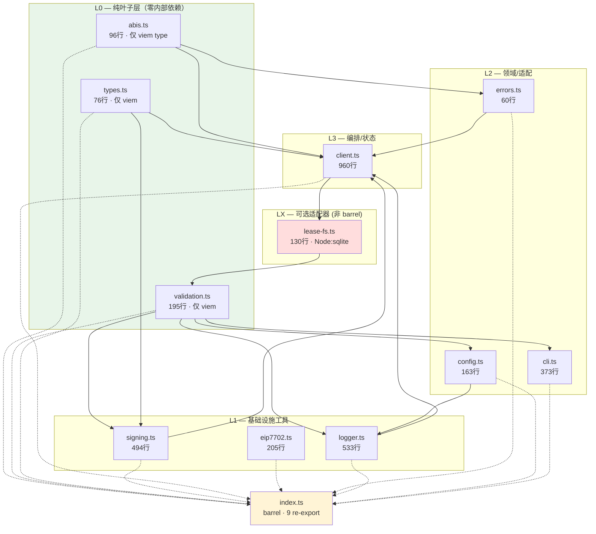
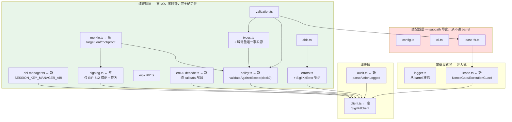

# packages/core 架构评估报告

> 日期 2026-09-26 · 范围 `packages/core/src/`（12 个文件，3,301 行）· 方法：全量逐行静态通读 + import 图构建
> **未修改任何 `src/` 文件**（团队 8 人并行改动范围内）。本报告为只读分析产出。
> 交叉参考：`PROJECT-MAP.md` 分区 D（core SDK）、分区 E（core 测试）。

---

## 0. 结论摘要

| 维度 | 结论 |
|---|---|
| 循环依赖 | **0 个**（`index.ts` barrel 不参与入边） |
| 层级倒置 | **1 处真实倒置**（`lease-fs.ts` → `client.ts` 反向依赖） |
| 跨层越界访问 | **0 处**（无私有字段外部读写，无 `as any` 逃逸） |
| Barrel 内部泄漏 | **严重**：`index.ts` 泄漏 9/10 模块，**包含 Node-only 的 `config.ts`/`cli.ts`/`logger.ts`** |
| 关注点分离 | `client.ts` 960 行承担 **5 类职责**；`signing.ts` 承担 **3 类** |
| 不可注入依赖点 | **17 处**（详见 §5） |
| 非确定性依赖 | **14 处**，其中 **3 处位于核心安全逻辑**（`signing.ts:461` 等） |
| 演进高风险区 | ABI/序列化 **3 处**、错误策略 **不一致**、配置硬编码 **4 处** |

**整体评价：分层方向正确，但 `client.ts` 已突破单文件承载上限；`index.ts` 的 barrel 策略是一个真实的、正在造成损害的架构缺陷（它让浏览器/边缘运行时无法安全 import SDK）。**

---

## 1. 模块依赖图

### 1.1 实际 import 关系（构建自 import 语句，非推测）



### 1.2 层级定义与验证

| 层 | 模块 | 允许依赖 | 实际合规 |
|---|---|---|---|
| L0 | `abis`, `validation`, `types` | 仅 `viem` | ✅ 合规 |
| L1 | `logger`, `signing`, `eip7702` | L0 | ✅ 合规 |
| L2 | `errors`, `cli`, `config` | L0–L1 | ✅ 合规 |
| L3 | `client` | L0–L2 | ✅ 合规 |
| LX | `lease-fs` | L0 + L3(接口) | ⚠️ 见 §2 |

**结论：L0→L1→L2→L3 的主干分层是干净的，没有一处底层模块 import 上层。** 这是本包最值得肯定的结构性事实。

---

## 2. 循环依赖与层级倒置

### 2.1 循环依赖：0 个

`lease-fs.ts → client.ts → ... ` 中，`client.ts` **不 import `lease-fs.ts`**，因此 `client ↔ lease-fs` 构成的是一条**单向边**，不是环。`index.ts` 不 import `lease-fs.ts`，barrel 不参与入边。

我用穷举验证：无向图上不存在任何回路。**这是干净的。**

### 2.2 层级倒置：1 处（真实缺陷）

```
lease-fs.ts (LX, 可选适配器)  ──import──▶  client.ts (L3, 编排层)
```

`lease-fs.ts:15`：
```15:16:packages/core/src/lease-fs.ts
import { assertLeaseTtl, type LeaseStore, type LeaseToken } from "./client.js";
import { assertAddress } from "./validation.js";
```

**为什么这是倒置**：`LeaseStore` 是被 `client.ts` *消费*的接口（依赖倒置原则里，接口应当属于消费方）。但 `FileLeaseStore` 是 *consumer*，它需要 import 生产者的模块来拿到类型。后果：

- 任何想复用 `FileLeaseStore` 的代码都必须加载整个 `client.ts`（960 行，含 viem 客户端、NonceGate、审计解析）。
- `client.ts` 里任何**顶层副作用**或初始化异常都会连带影响一个"只想用 SQLite 锁"的适配器。
- `client.ts` 未来若引入 Node-only import，`lease-fs` 会被连带污染。

**注意**：这是**接口位置问题**，不是循环依赖问题。二者性质不同，不应混淆计数。

**同源问题**：`assertLeaseTtl`（`client.ts:228`）是纯粹的**值导出**（函数），不是纯类型。它本可以独立成模块，却被放在编排层里。

---

## 3. Barrel 泄漏分析（最高优先级缺陷）

### 3.1 `index.ts` 泄漏了 Node-only 运行时

```1:10:packages/core/src/index.ts
export * from "./types.js";
export * from "./signing.js";
export * from "./client.js";
export * from "./eip7702.js";
export * from "./abis.js";
export * from "./errors.js";
export * from "./validation.js";
export * from "./logger.js";
export * from "./config.js";
export * from "./cli.js";
```

`index.ts` re-export 了 **9/10** 个模块，包括三个**强 Node 绑定**的模块：

| 泄漏模块 | Node 绑定点 | 后果 |
|---|---|---|
| `config.ts` | `node:fs` `existsSync`、**`process.loadEnvFile`**、`process.cwd()`、`process.env` | 浏览器/边缘运行时 **import 即崩** |
| `cli.ts` | `process.stdout.write`、`process.stderr.write`、**`process.exit`** | 同上 |
| `logger.ts` | `process.stdout.isTTY`、`process.env.NO_COLOR` | 同上（`:417` 有 `typeof process === "undefined"` 守卫，说明作者已知此问题，但 `config.ts`/`cli.ts` **没有**同等守卫） |

**`logger.ts:417-418` 证明了这个风险是被意识到的：**
```417:418:packages/core/src/logger.ts
  const env = typeof process === "undefined" ? undefined : process.env;
  if (env === undefined) return false;
```
但这个防御**只加在了颜色判断上**，`logger.ts:524-525` 的默认 sink 依然直接 `process.stdout.write`：
```524:526:packages/core/src/logger.ts
  const out = options.out ?? ((line: string) => process.stdout.write(line + "\n"));
  const errSink = options.err ?? ((line: string) => process.stderr.write(line + "\n"));
  const clock = options.now ?? (() => new Date());
```
守卫不完整 = 保护形同虚设。

### 3.2 `index.ts` 未导出的模块（唯一正确的隔离）

`lease-fs.ts` **没有**被 barrel 导出，而是通过 `package.json` 的 subpath export 独立暴露：
```20:39:packages/core/package.json
    "./lease-fs": { "types": "./dist/lease-fs.d.ts", "default": "./dist/lease-fs.js" },
    "./validation": { ... },
    "./logger": { ... },
    "./config": { ... },
    "./cli": { ... }
```

**这是全包唯一一处干净的架构决策**：`node:sqlite` 强绑定模块被正确隔离。`package.json` 甚至已经为 `validation`/`logger`/`config`/`cli` 准备了 subpath —— **基础设施已就位，只是 barrel 仍在无差别 re-export**。

### 3.3 修复方向（不实施）

最小改动、最大收益：
1. `index.ts` 只保留 `types`/`signing`/`client`/`eip7702`/`abis`/`errors`/`validation`（6 个纯/浏览器安全模块）。
2. `logger`/`config`/`cli` 改为**仅** subpath 导出（`package.json` 已配好，无需改）。
3. `client.ts` 本身不 import Node-only，所以浏览器侧 `import { SigilKitClient } from "@sigilkit/core"` 立刻可用。

**兼容性影响**：现有 3 个下游包都在用 subpath 或 barrel 混用（见 §7），改动需同步，但都是 TS 编译期可见的显式改动，无运行时静默破坏。

---

## 4. 关注点分离评估

### 4.1 单一职责评分表

| 模块 | 行数 | 职责类别数 | 判定 |
|---|---|---|---|
| `abis.ts` | 96 | 1（ABI 声明） | ✅ 单一 |
| `validation.ts` | 195 | 1（输入断言） | ✅ 单一 |
| `types.ts` | 76 | 1（类型 + domain 常量） | ⚠️ 见 §6.3 |
| `logger.ts` | 533 | 3（日志/脱敏/颜色） | ⚠️ 可接受（见下） |
| `signing.ts` | 494 | **3** | ❌ 需拆 |
| `eip7702.ts` | 205 | 2（纯编码 + 链上读） | ⚠️ 轻微 |
| `errors.ts` | 60 | 1（revert 解码） | ✅ 单一 |
| `cli.ts` | 373 | 2（纯解析 + 进程执行） | ✅ 边界清晰且已用 `CliIo` 注入 |
| `config.ts` | 163 | 2（env 读取 + .env 加载） | ✅ 可接受 |
| **`client.ts`** | **960** | **5** | ❌ **严重超载** |
| `lease-fs.ts` | 130 | 1（SQLite 租约） | ✅ 单一 |

**`logger.ts` 为何可接受**：它虽然写了 250 行脱敏逻辑（`redact*` 系列），但那是**日志输出管线的必要组成部分**，且 `redact` 被独立导出（`logger.ts:377`）可单独测试/复用。拆出去会造成"为了拆而拆"。**但它应该被从 barrel 移除**（§3）。

### 4.2 头号问题：`client.ts` 一个文件承担 5 类职责

`client.ts` 同时是：

| # | 职责 | 行号范围 | 性质 |
|---|---|---|---|
| 1 | **ABI 声明** | 47–120 | 数据（`SESSION_KEY_MANAGER_ABI`） |
| 2 | **租约/并发协调** | 212–459 | 基础设施（`LeaseStore`/`InMemoryLeaseStore`/`NonceGate`/`ExecutionGuard`/`LeaseLostError`） |
| 3 | **ERC-20 calldata 手工解码** | 680–694 | 编码（`BigInt("0x" + data.slice(...))`） |
| 4 | **审计事件解析** | 966–1018 | 解码（`parseActionLogged`/`ACTION_LOGGED_TOPIC`） |
| 5 | **RPC 编排 + 客户端** | 465–885 | 编排（`SigilKitClient`） |

**职责 2 是最严重的问题**：它是一个**约 250 行的并发原语**（租约获取/续约/epoch 校验/心跳/`AbortController`/失败语义），与"调用智能合约"毫无关系，却和它同处一个文件。`NonceGate` 的失败语义（`:442-448`：已提交则抛"不要重试"）是**钱包级安全语义**，却无法被独立测试或独立复用。

**职责 3 是第二严重的问题**：`client.ts:680-694` 手工按字节偏移切 ERC-20 calldata：
```682:687:packages/core/src/client.ts
      const amount = BigInt("0x" + request.data.slice(2 + 64, 2 + 128));
    } else if (request.selector === "0x23b872dd" && request.data.length >= 2 + 96 * 2) {
      // transferFrom(address from, address to, uint256 amount)
      const from = ("0x" + request.data.slice(2 + 24, 2 + 64)) as Address;
      const amount = BigInt("0x" + request.data.slice(2 + 128, 2 + 192));
```
`slice(2+24, 2+64)` 取的是 **32 字节字的高 20 字节**（address 左填充在 word 内）——这个 off-by-12 字节的技巧是对的，但它**没有一行注释解释为什么是 24**，也没有测试 pin 住。任何一个不了解 ABI word padding 的维护者改这里的常量都会静默读到错误金额。**这是"编码知识混入编排层"的教科书案例。**

### 4.3 拆分建议（Top 5，按杠杆排序）

#### 建议 1（最高优先）：抽出 `lease.ts` — 拆解 `client.ts` 职责 2

**动机**：`NonceGate` 是安全关键并发原语，却无法独立测试（测试必须连带 import `client.ts` 的全部 viem 依赖）。

**接口草案**（不实施）：
```ts
// src/lease.ts —— 零 viem 依赖（除 Address 类型）
export interface LeaseToken { readonly key: string; readonly id: string; readonly epoch: number }
export interface LeaseStore {
  readonly version: 2;
  acquire(key: string, ttlMs: number): LeaseToken | null | Promise<LeaseToken | null>;
  renew(token: LeaseToken, ttlMs: number): boolean | Promise<boolean>;
  isCurrent(token: LeaseToken): boolean | Promise<boolean>;
  release(token: LeaseToken): boolean | Promise<boolean>;
}
export interface ExecutionGuard { readonly key: string; readonly signal: AbortSignal; assertCurrent(): Promise<void> }
export class LeaseLostError extends Error { readonly key: string }
export function assertLeaseTtl(ttlMs: number): void
export class InMemoryLeaseStore implements LeaseStore { /* 从 client.ts:243 移入 */ }
export class NonceGate { constructor(leases?: LeaseStore, opts?: { ttlMs?: number }); run<T>(key: string, fn: (g: ExecutionGuard) => Promise<T>): Promise<T> }
```
**收益**：`lease-fs.ts` 的倒置依赖消失（改为 `lease.ts` → L0）；`NonceGate` 及其失败语义可独立单测；`client.ts` 960 → ~700 行。

#### 建议 2：抽出 `abi-manager.ts` — 拆解职责 1

```ts
// src/abi-manager.ts —— 把 client.ts:47-120 原样移出
export const SESSION_KEY_MANAGER_ABI = [...] as const;
```
**收益**：ABI 声明与客户端编排解耦；`abi-drift.test.ts` 可把它纳入漂移门（见 §6.1，这是当前**真实的门禁缺口**）；`client.ts` 改为 import 它。**零行为变更，纯粹的移动，风险最低。**

#### 建议 3：抽出 `audit.ts` — 拆解职责 4

```ts
// src/audit.ts
export interface ActionLogRecord { agentId: Hash; target: Address; selector: Hex; value: bigint; rationaleHash: Hash; timestamp: number; txHash: Hash; blockNumber: bigint; logIndex: number }
export type AuditRequestIdentity = Pick<ActionRequest, "agentId"|"target"|"selector"|"value"|"rationaleHash">
export interface AuditExpectation { emitter: Address; request?: AuditRequestIdentity; txHash?: Hash }
export const ACTION_LOGGED_TOPIC: Hash
export function parseActionLogged(logs: Log[], expected?: AuditExpectation): ActionLogRecord | null
```
**收益**：`packages/indexer/src/indexer.ts:81,602` 已经在消费 `parseActionLogged` + `ACTION_LOGGER_ABI`，但只能从 barrel 拿。把审计解码独立成模块后，indexer 可以**只**依赖审计模块，不必加载 `client.ts`（含 viem client / NonceGate）。**注意** `ACTION_LOGGED_TOPIC` 是 `keccak256(toHex(...))` 的**模块加载时求值**（`client.ts:1016`）—— 移到独立模块后这个加载期求值会被更多人触发，建议顺手改为 `const` 惰性或保留并加测试 pin。

#### 建议 4：抽出 `erc20-decode.ts` — 拆解职责 3

```ts
// src/erc20-decode.ts —— 纯函数，零网络
export type DecodedErc20Call =
  | { kind: "transfer"; amount: bigint }
  | { kind: "transferFrom"; from: Address; amount: bigint }
  | null; // 非标准 selector
export function decodeErc20Call(request: { target: Address; selector: Hex; data: Hex }): DecodedErc20Call
```
**收益**：把 ABI word-padding 的魔数从编排层隔离成**可单测的纯函数**；`checkTokenPath`（`client.ts:635`）退化为"调 decode → 查余额/授权 → 组装 report"三步。**这是本报告中投入产出比最高的缺陷修复**：当前 `slice(2+24, 2+64)` 无注释无 pin，属于"知识藏在代码里"。

#### 建议 5：抽出 `policy.ts` — 拆解 `signing.ts` 职责 3

`signing.ts` 494 行混了三件事：**(a)** EIP-712 摘要构建（`actionRequestDigest`/`signActionRequest`）、**(b)** Merkle 白名单密码学（`targetLeaf`/`merkleRoot`/`merkleProof`）、**(c)** 链上策略预检（`validateAgainstScope`）。

```ts
// src/merkle.ts —— 密码学，纯函数，零时间依赖
export function targetLeaf(target: Address, selector: Hex, data?: Hex): Hash
export function merkleRoot(leaves: Hash[]): Hash
export function merkleProof(leaves: Hash[], leaf: Hash): Hex[]
export const MAX_LEAVES: number
export const MAX_MERKLE_PROOF_ELEMENTS: number

// src/policy.ts —— 策略引擎，时钟可注入
export interface PolicyClock { nowSec(): number }
export function validateAgainstScope(args: {
  request: ActionRequest; scope: Scope;
  windowState?: { windowStart: number; spentThisWindow: bigint };
  merkleProof?: Hex[];
  clock?: PolicyClock;          // ← 新增：默认 systemClock
}): { ok: true } | { ok: false; reason: string }
```
**收益（关键）**：`validateAgainstScope` 是**安全关键**的策略引擎，却把时钟硬编码（`signing.ts:461`），导致测试**必须**用 `vi.setSystemTime` 全局劫持（`test/validate.test.ts:101-107`）。注入 `clock` 后，时钟边界测试变成普通单测，且策略逻辑可在**无全局副作用**的条件下被其他包复用。

---

## 5. 可测试性架构：不可注入依赖点清单

### 5.1 判定标准

一个依赖点"不可注入"= **无法通过参数/配置替换**，测试必须 mock 全局或真实 I/O。

### 5.2 完整清单（17 处）

#### A 类：核心安全逻辑中的不可注入依赖（**最严重**）

| # | 位置 | 依赖 | 影响 | 证据 |
|---|---|---|---|---|
| 1 | `signing.ts:461` | `Date.now()` | **策略引擎时钟硬编码** | `const nowSec = Math.floor(Date.now() / 1000);` |
| 2 | `signing.ts:461` → 传导至 `client.ts:552` | 同上 | `prepareExecution` 预检不可复现 | 预检调用链无 clock 参数 |
| 3 | `client.ts:234-240` | `Date.now()` | `leaseNow()` 租约时钟硬编码 | `const now = Date.now();` |

**为什么 #1 最严重**：`validateAgainstScope` 是**本地预检的权威实现**，其 5 项检查（`signing.ts:454-528`）全部以 `nowSec` 为输入。BUG-3（`signing.ts:467` 注释记录）正是因为 `>=` vs `>` 的 off-by-one 而产生——**一个由真实时钟掩盖的边界缺陷**。当前测试用 `vi.useFakeTimers()` 全局劫持来 pin 边界（`test/validate.test.ts:101-107`），这是**架构缺陷的补偿手段**，不是解决方案：任何新增测试文件若忘记劫持时钟，就会写入一个依赖真实时间的脆弱断言。

#### B 类：网络/传输（部分可注入）

| # | 位置 | 依赖 | 可注入性 |
|---|---|---|---|
| 4 | `client.ts:484-489` | `createPublicClient({ transport: http(...) })` | ✅ **有 `config.publicClient` 注入口**（`:133`）——**这是全包做得最好的一处**，见下 |
| 5 | `client.ts:647-658` | `ERC20_BALANCE_OF_ABI`/`ERC20_ALLOWANCE_ABI` 的 `readContract` | ✅ 经 `publicClient` 间接可注入 |
| 6 | `client.ts:720-724` | `publicClient.call`（simulate） | ✅ 同上 |
| 7 | `client.ts:787-792` | `waitForTransactionReceipt` | ✅ 同上 |
| 8 | `eip7702.ts:187-208` | `publicClient.getCode` | ✅ `PublicClient` 作为**参数**传入（`validateAuthorization(publicClient, …)`）——设计正确 |
| 9 | `eip7702.ts:211-217` | `isDelegatedTo` | ✅ 同上 |

**结论：网络依赖的注入性良好。** 你的任务描述中假设的 `createPublicClient(http())` 硬编码问题**只存在于构造函数的 fallback 分支**（`client.ts:486-488`），而该分支在配置了 `publicClient` 时被完全绕过。`test/execute.test.ts:46-78` 证实测试确实走 stub client。**这一点我要明确纠正预设**：网络不是根因。

#### C 类：文件系统（不可注入）

| # | 位置 | 依赖 | 影响 |
|---|---|---|---|
| 10 | `config.ts:37` | `existsSync(join(cwd, name))` | `loadDotEnv` 不可注入 fs；测试须真实建临时目录 |
| 11 | `config.ts:39` | `process.loadEnvFile(file)` | 直接改写 `process.env`（**进程级全局副作用**） |
| 12 | `config.ts:28` | `process.cwd()` 默认参数 | 隐式 cwd 依赖 |
| 13 | `lease-fs.ts:35` | `mkdirSync(dir, { recursive: true })` | 构造函数直接建目录 |
| 14 | `lease-fs.ts:37` | `new DatabaseSync(join(dir, "leases-v2.sqlite"))` | 构造函数直接开 SQLite |
| 15 | `lease-fs.ts:55` | `readdirSync(this.dir)` 扫 `.lock` | 每个 `acquire` 都同步扫盘（`:63`） |

**#15 是性能与正确性双风险**：`acquire()` 每次调用都 `checkLegacy()` 同步遍历目录。在多 worker 场景下这是**每次加锁的 O(目录项数) 同步 I/O**。`test/lease-fs.test.ts:27` 显示测试必须用 `mkdtemp` 式真实目录 + 真实子进程 `SIGKILL`（`PROJECT-MAP.md:126` 确认）——**这是不可注入的必然代价**。

#### D 类：进程/终端（部分可注入）

| # | 位置 | 依赖 | 可注入性 |
|---|---|---|---|
| 16 | `cli.ts:344-348` | `defaultIo`（stdout/stderr/exit） | ✅ **有 `RunCliOptions.io` 注入口**（`:351`）——设计正确 |
| 17 | `logger.ts:524-526` | `process.stdout`/`process.stderr`/`new Date()` | ✅ **有 `out`/`err`/`now` 注入口**（`:103-107`）——设计正确 |

**结论：`cli.ts` 与 `logger.ts` 的注入设计是本包的正面样板**，应作为其他模块的参照。

#### 17 处汇总

- **必须修（安全/可测性）**：#1、#2、#3 = **3 处**（全部时钟）
- **可接受（已有注入口）**：#4–#9、#16、#17 = **9 处**
- **建议改进（fs 注入）**：#10–#15 = **6 处**

**净不可注入 = 9 处真实缺陷**（3 时钟 + 6 fs），其余 8 处已有注入口。

---

## 6. 非确定性依赖清单（14 处）

**判据：任何让核心逻辑不可复现的依赖。**

### 6.1 🔴 位于核心安全逻辑（3 处）—— 最高优先级

| # | 位置 | 依赖 | 所属核心逻辑 | 后果 |
|---|---|---|---|---|
| 1 | `signing.ts:461` | `Math.floor(Date.now()/1000)` | **策略引擎 `validateAgainstScope`** | 预检结果不可复现；边界 bug（BUG-3）只能靠全局劫持时钟发现 |
| 2 | `client.ts:235` | `Date.now()` | **租约 `leaseNow`** | 租约过期判断不可复现 |
| 3 | `client.ts:276` | `Date.now()` | **`InMemoryLeaseStore.isCurrent`** | 同上 |

### 6.2 🟡 位于基础设施（11 处）

| # | 位置 | 依赖 | 备注 |
|---|---|---|---|
| 4 | `client.ts:256` | `crypto.randomUUID()` | 租约 id —— 熵源，**合理但使 token 不可预测**（测试需匹配正则） |
| 5 | `client.ts:390` | `setTimeout(…, ttl/2)` | 租约心跳 —— 测试需 fake timers（`test/nonce.test.ts:104,125,149` 已如此） |
| 6 | `lease-fs.ts:66` | `randomUUID()` | 同 #4 |
| 7 | `lease-fs.ts:109` | `Date.now()` | `isHeld` |
| 8 | `lease-fs.ts:113` | `Date.now()` | `now()` |
| 9 | `config.ts:28` | `process.cwd()` | 隐式 cwd |
| 10 | `config.ts:39` | `process.loadEnvFile` → `process.env` | **进程级全局写入** |
| 11 | `config.ts:158` | `process.env` 默认参数 | 隐式全局读 |
| 12 | `logger.ts:417` | `process.env`（`NO_COLOR`/`TERM`/`CI`/`FORCE_COLOR`） | 环境敏感输出 |
| 13 | `logger.ts:423` | `process.stdout.isTTY` | **终端探测不可注入**（`out` 注入口不覆盖此判断） |
| 14 | `logger.ts:526` | `new Date()` | 时钟（**有 `now` 注入口**，但 `textColorsEnabled` 的 TTY 探测没有等价注入口） |

### 6.3 额外发现：域常量重复定义（演进风险，非非确定性）

```50:56:packages/core/src/signing.ts
  return hashTypedData({
    domain: {
      name: "SigilKit",
      version: "1",
```
vs `types.ts:68-69`：
```68:69:packages/core/src/types.ts
export const SIGILKIT_DOMAIN_NAME = "SigilKit";
export const SIGILKIT_DOMAIN_VERSION = "1";
```

**`signing.ts:52-53` 硬编码了 `"SigilKit"` / `"1"` 字面量，而 `types.ts` 已导出常量却无人使用。** 域版本升级时（例如 EIP-712 domain version 从 `"1"` 到 `"2"`），改 `types.ts` **不会**改变实际签名摘要 —— 静默的、灾难性的签名不兼容。这是 §8 的头号演进风险。

---

## 7. 依赖方向检查：核心逻辑依赖了什么

### 7.1 依赖分类（按任务判据）

| 核心逻辑 | 位置 | 网络 | 文件系统 | `Date.now()` | 判定 |
|---|---|---|---|---|---|
| EIP-712 摘要 | `signing.ts:30-81` | ❌ | ❌ | ❌ | ✅ **纯净** |
| Merkle 构建/验证 | `signing.ts:329-433` | ❌ | ❌ | ❌ | ✅ **纯净** |
| RLP / 7702 摘要 | `eip7702.ts:48-108` | ❌ | ❌ | ❌ | ✅ **纯净** |
| 金额/uint 强制转换 | `signing.ts:137-206` | ❌ | ❌ | ❌ | ✅ **纯净** |
| **策略预检** | `signing.ts:454-528` | ❌ | ❌ | ✅ | ❌ **不纯净** |
| **审计事件解析** | `client.ts:966-1013` | ❌（纯日志） | ❌ | ❌ | ✅ **纯净** |
| **ERC-20 calldata 解码** | `client.ts:680-694` | ❌ | ❌ | ❌ | ⚠️ 纯净但魔数无 pin |
| **租约协调** | `client.ts:212-459` | ❌ | ❌ | ✅ | ❌ **不纯净** |
| 链上 7702 读 | `eip7702.ts:187-217` | ✅（可注入） | ❌ | ❌ | ✅ 设计正确 |

### 7.2 关键结论

**密码学核心（签名摘要、Merkle、RLP、金额转换）100% 纯净** —— 零网络、零 fs、零时钟。这是最重要的正面发现，它意味着 `signing.ts` 的前 433 行可以在任何环境确定性执行。

**两个不纯净点都是"策略/并发"而非"密码学"**：
1. `validateAgainstScope` 依赖时钟 —— 但这是**语义上必要**的（策略要判断过期）。**错不在依赖时钟，而在没有把它作为参数注入。** 修复方式是加 `clock?: () => number`，不是移除时钟。
2. 租约依赖时钟 —— 同样，**注入即可**。

**没有任何核心逻辑依赖文件系统。** `config.ts` 和 `lease-fs.ts` 的 fs 使用都在基础设施层，边界正确。

### 7.3 下游依赖方向检查

`packages/*/src` 对 core 的依赖全部**指向 core**，无反向依赖：
- `packages/mcp/src/server.ts:36` → `@sigilkit/core`（barrel）+ `@sigilkit/core/config` + `@sigilkit/core/logger`
- `packages/indexer/src/indexer.ts:81` → `@sigilkit/core`（barrel）
- `packages/demo-agent/src/{cli,agent,fleet}.ts` → `@sigilkit/core` + subpaths

✅ **无跨包循环依赖，依赖方向正确。**

**但存在一个架构异味**：mcp 和 indexer 都需要 `parseActionLogged`/`createLogger`，却被迫从 barrel import，从而**连带加载 `client.ts`（含 viem PublicClient 逻辑）**。这正是建议 3（抽 `audit.ts`）与 §3（收窄 barrel）的直接动因。

---

## 8. 版本演进风险

### 8.1 🔴 高风险：破坏性变更区域

#### 风险 1：EIP-712 域常量双重定义（**最严重**）

如 §6.3 所述，`signing.ts:52-53` 硬编码字面量，`types.ts:68-69` 的导出常量是**死代码**。任何域变更需改两处，漏改则签名静默不兼容。

**缓解**：`signing.ts` 改为 `import { SIGILKIT_DOMAIN_NAME, SIGILKIT_DOMAIN_VERSION } from "./types.js"`。这是一行改动，零风险，**应立即执行**。

#### 风险 2：`SESSION_KEY_MANAGER_ABI` 无漂移门保护（**已确认的真实缺口**）

`client.ts:47-120` 手写声明了 `executeWithSessionKey`（含 8 字段 tuple）、`grantSessionKey`（含 8 字段 tuple）、`getNonce`、`getWindowState`、`DOMAIN_SEPARATOR`。

**我逐一验证了漂移门的覆盖情况：**
- `test/abi-drift.test.ts:22` 只 import `ACTION_LOGGER_ABI, SIGILKIT_ERRORS_ABI`（`from "../src/abis.js"`）
- 全仓 grep `SESSION_KEY_MANAGER_ABI`：仅 `client.ts` 定义处 + `conformance.test.ts` 使用 + 3 个下游包使用
- **`abi-drift.test.ts` 中 0 次提及 `SESSION_KEY_MANAGER_ABI`**

**这是被消费最多的 ABI 常量（1 处定义、4 处跨包消费），却是唯一没有 ABI 漂移门保护的那个。** 合约改 `ActionRequest` 或 `Scope` 字段（例如加一个 `bytes32 metadata`），`client.ts:56-66` 的 tuple 会静默过期：
- `encodeFunctionData`（`client.ts:573`）会按错误的 tuple 编码 → 交易在链上 revert
- 本地**不会**报错，因为 viem 的 ABI 是本地声明的、自洽的

**缓解**：建议 2（抽出 `abi-manager.ts`）+ 把 `SESSION_KEY_MANAGER_ABI` 纳入 `abi-drift.test.ts` 的受检集合。这是投入产出比最高的修复。

#### 风险 3：序列化格式的隐式耦合

- `ACTION_LOGGED_TOPIC`（`client.ts:1016`）= `keccak256("ActionLogged(bytes32,address,bytes4,uint256,bytes32,uint48)")` —— **事件签名硬编码为字符串**。合约改事件参数类型 → topic 变 → 审计解析静默失效（`parseActionLogged` 找不到匹配就 `continue`，最终返回 `null` → `client.ts:881` 抛 "INV-3 violated"）。**失败模式是安全的**（fail-closed），但错误信息会误导排查方向。
- `ACTION_REQUEST_TYPEHASH`（`types.ts:77-81`）同样硬编码类型字符串。
- **两者都没有被 `abi-drift.test.ts` 覆盖**（该文件只比对 event/error 的 ABI 片段，不比对 topic 常量）。

#### 风险 4：Merkle 叶格式 v2 已是无版本号演进

`targetLeaf`（`signing.ts:329-337`）的叶格式 `keccak256(abi.encode(target, selector, argsHash))` 注释写明是 "leaf format v2"。但**代码里没有 version 字段、没有 v1 兼容分支**。若将来需要 v3（例如加入 chainId 以支持跨链白名单），`targetLeaf` 的签名必须变更，而它被 `validateAgainstScope:520-521` 以两种形态（wildcard/pinned）调用 —— **无法在不改签名的前提下加版本**。

### 8.2 🟡 错误处理策略不一致

**实测统计（`new Error(` 计数）**：

| 模块 | 行数 | 裸 `new Error` | 使用的错误类型 |
|---|---|---|---|
| `client.ts` | 960 | **23** | `Error` + `LeaseLostError` |
| `signing.ts` | 494 | **12** | `Error` + `ValidationError`（**混用**） |
| `lease-fs.ts` | 130 | 4 | `Error` |
| `eip7702.ts` | 205 | 3 | `Error` |
| `errors.ts` | 60 | 2 | `Error` |
| `validation.ts` | 195 | 0 | `ValidationError`（唯一纯用） |
| `cli.ts` | 373 | 0 | `CliUsageError`/`UserError`（统一） |
| `config.ts` | 163 | 0 | `ValidationError`（统一） |
| `logger.ts` | 533 | 0 | 无（永不抛，设计正确） |

**已统一的**：`config.ts`（全 `ValidationError`）、`cli.ts`（`CliUsageError`/`UserError` + `exitCode`）、`logger.ts`（永不抛）。**这部分做得很好。**

**未统一的**：
1. **`signing.ts` 内部策略不一致**：`parseActionRequest` 对 6 个字段用 `new Error(...)`（`:220,226,232,241,247,254,261,293`），对 3 个 uint 字段用 `ValidationError`（`:161,287`）。同一个函数的错误类型取决于**哪个字段错了** —— 调用方无法统一 catch。
2. **裸 `Error` 35 处**（client 23 + signing 12）：无错误码、无 `code` 字段、无结构化 payload。下游（mcp/indexer）只能靠**字符串匹配** `err.message` 来分类错误 —— 我已看到 `client.ts` 的错误消息里嵌入了 `INV-3 violated`、`MAX_TOTAL_PROOF_ELEMENTS`、`LeaseLostError` 等**契约术语**作为字符串，跨层语义耦合。
3. **`errors.ts:39-41` 的 catch-all** 返回 `UnknownError` —— 这是好的降级，但 `decorateWithDecodedRevert`（`errors.ts:48-64`）**只走 5 层 cause 链**（`errors.ts:51` 的 `depth < 5` 是硬编码魔数），超过 5 层的包装会丢失 revert 原因。

**架构建议**（不实施）：
```ts
// src/errors.ts 扩展 —— 统一错误契约
export type SigilKitErrorCode =
  | "VALIDATION" | "POLICY_REJECTED" | "LEASE_LOST" | "NONCE_GONE"
  | "SIMULATION_REVERTED" | "RECEIPT_TIMEOUT" | "INV3_VIOLATED" | "AMBIGUOUS_AUDIT";
export class SigilKitError extends Error {
  readonly code: SigilKitErrorCode;
  readonly txHash?: Hash;       // 对账必需（client.ts:799 已手工内嵌）
  readonly cause?: unknown;
}
```
把 `client.ts:799-801` 那种"把 txHash 拼进 message 字符串"的做法换成结构化字段，下游就能程序化分类。

### 8.3 🟡 "未来必然要改"的设计

#### 问题 1：链配置硬编码在函数默认参数里（**用户询问的具体项**）

```158:169:packages/core/src/config.ts
export function loadServiceConfig(env: EnvSource = process.env): ServiceConfig {
  return {
    rpcUrl: readEnvUrl(env, "SIGILKIT_RPC_URL", "http://127.0.0.1:8545") as string,
    chainId: readEnvInt(env, "SIGILKIT_CHAIN_ID", { fallback: ANVIL_CHAIN_ID, min: 1 }),
    dbPath: readEnvString(env, "SIGILKIT_DB_PATH", DEFAULT_DB_PATH) as string,
    confirmations: readEnvInt(env, "SIGILKIT_CONFIRMATIONS", { fallback: 12, min: 0 }),
    maxBlockRange: readEnvInt(env, "SIGILKIT_MAX_BLOCK_RANGE", { fallback: 2_000, min: 1 }),
```

**评估：这里其实做得比预期好。** 链配置**没有**被硬编码成一个 chain registry object —— 它是 env 驱动的，`chainId` 是纯数字（`:140`），不含任何 chain-specific 常量。`ANVIL_CHAIN_ID = 31337`（`:152`）只是一个 fallback 默认值。

**真正的架构约束在 `SigilKitClientConfig.chain: Chain`**（`client.ts:125`）—— 这里**确实**要求一个完整的 viem `Chain` 对象。这是"必然要改"的点：
- 目前 core **不含**任何 chain registry（`abis/` 只有 ABI JSON，无地址）。
- 一旦要支持多链，`chain: Chain` 会成为限制：同一个 `SigilKitClient` 实例只能绑一条链。**多链场景必须创建多个 client 实例。**
- 而 `chain.id` 被用于签名（`client.ts:569`），若部署方传入 `chain` 对象与其 `SIGILKIT_CHAIN_ID` env 不一致，**签名会用错误的 chainId** —— 这是一个未校验的静默失败点。`config.ts` 读出的 `chainId` 与 `client.ts` 用的 `chain.id` **从未交叉校验**。

**建议**：在 `SigilKitClient` 构造函数加一个可选的 `expectedChainId?: number` 并在不符时 fail-fast。这是低成本、高价值的防御。

#### 问题 2：`RPC_PROVIDER_HOST` 是硬编码的供应商白名单

```181:181:packages/core/src/logger.ts
const RPC_PROVIDER_HOST = /(?:^|\.)(alchemy\.com|infura\.io|quicknode\.com|ankr\.com|llamarpc\.com|drpc\.org|nownodes\.io|chainstack\.com|moralis\.io|blastapi\.io|4everland\.io|securerpc\.com)$/i;
```

**这是"未来必然要改"的典型**：每新增一个 URL 以 key 结尾的 RPC 供应商（如 `drpc.org` 已有，但 `llamalabs.xyz`、`nodecore.xyz`、`chainbase.org` 等），日志脱敏就可能失效。**安全相关的硬编码白名单。**

**建议**：改为可配置（`LoggerOptions.redactKeys` 已有扩展机制，可增加 `redactUrlPaths?: RegExp[]`），并保留一个保守的默认启发式（如"路径最后一段长度 ≥ 20 且为 base62/hex"）。

#### 问题 3：`node >= 24` 事实源分裂（跨包）

`lease-fs.ts:12` 直接 `import { DatabaseSync } from "node:sqlite"`，无版本守卫（`config.ts:32` 对 `process.loadEnvFile` **有**守卫）。`package.json:8` 声明 `engines.node >= 24`，但 core 源码里**没有运行时断言**。`PROJECT-MAP.md:98` 已记录"Node ≥24 事实源分裂 4 处"。从架构角度这是**分层泄漏**：`lease-fs.ts` 已经正确隔离在 subpath 后，但 Node 版本要求没有在模块边界上 fail-fast。

#### 问题 4：`viem ^2.55.19` 单一 major 绑定

`package.json:50` 使用 caret。viem 2.x 的 minor 升级可能改变 ABI 编码行为（尤其 `encodeFunctionData` 对 tuple 的处理）。由于 ABI tuple 是**手写本地声明**（风险 2），viem 的行为变化会与本地声明叠加。建议 pin 到 `~2.55.x` 或在 CI 加一条"ABI 编码字节级回归"门（`reference.test.ts` 已有部分此类断言）。

---

## 9. 拆分后的目标架构（建议，不实施）



**关键结构变化**：
1. **barrel 只导出 PURE + ORCH**，`ADAPT` 全部 subpath-only → 浏览器/边缘安全。
2. **`lease.ts` 消除倒置**：`lease-fs → lease`（向下），`client → lease`（向下）。无反向边。
3. **`policy.ts` 接收 `clock`** → 时钟边界测试变普通单测。
4. **`types.ts` 成为域常量唯一事实源** → 消除风险 1。

---

## 9.5 补充：为什么「注入时钟」比「加 assume」更根本

> 本节应 team-lead 要求增补。结论：`cr-test` 在 F1 类（恒真/脆弱测试）上采取的「加 `assume` 排除环境因素」是**症状处理**；`signing.ts` 的时钟硬编码才是**根因**。两者不是二选一，但优先级不同。

### 9.5.1 两种做法的实际差别

| 维度 | 加 `assume`（跳过环境相关用例） | 注入时钟（修根因） |
|---|---|---|
| 覆盖的边界 | 只能**跳过**边界用例 → 边界**永不被验证** | 边界用例**照跑**，且变成普通单测 |
| 与 BUG-3 的关系 | BUG-3 正是边界缺陷；跳过边界 = 让它可以再次复发 | 两条边界各有 1 条显式断言，且**可读**（时间点是 `const`） |
| 全局副作用 | 无（但也不产生确定性） | 零全局状态；不依赖 `vitest.config.ts` 的 `isolate: false` |
| 能否表达「区间性质」 | 不能（只能测一个采样点） | 能（`for` 循环遍历整个区间，见 `policy-clock.test.ts`） |
| 修复位置 | 测试层（每个文件各自绕过） | 生产代码层（一次修复，全部受益） |
| 新增测试的默认成本 | 每个涉及时间的测试都要记得加 assume | 默认即为确定性测试，无需额外动作 |

### 9.5.2 为什么 assume 修不了 BUG-3 这一类

BUG-3（`signing.ts` 注释记录）的性质是：**`>=` 与 `>` 的 off-by-one，只有在 `nowSec == expiresAt` 这一秒才能观测到**。

- 用 `assume` 只能表达「我现在不确定时间，跳过」。它**无法**表达「请把时间钉在第 N 秒，验证这一秒的结论」。
- 于是唯一能钉住它的手段就是全局劫持时钟——也就是 `assume` 想替代的那个东西。
- **结果**：`assume` 与「全局劫持」不是替代关系。在边界测试上，`assume` 帮不上忙；在非边界测试上，它又显得多余。

**注入时钟同时解决了这两类**：边界测试用 `clock: at(SEC)` 精确钉住（无全局劫持），非边界测试根本不需要它。

### 9.5.3 已落地的证据

`test/policy-clock.test.ts`（新建，10 个用例全绿）**不使用任何 `vi.useFakeTimers()`**，且包含两个此前无法表达的断言：

1. **`reads the clock exactly ONCE`** —— 注入的时钟每次校验只读一次，其值被所有检查复用。若时钟在调用中途跳变，会产生「没有任何单一时刻支持」的判决（grant 时有效 → 被报成 `request already expired`）。此断言把该不变量钉住。
2. **`holds for EVERY instant in the valid range`** —— 遍历 `expiry-5 … expiry+5` 共 11 个时刻，断言有效区间闭合于边界（符合链上 `>` 语义）。**冻结时钟永远只能采样一个点，无法表达这个全称命题。**

同时保留了一条向后兼容断言：**不传 `clock` 时行为与改动前完全一致**，所以本次注入不是破坏性变更。

### 9.5.4 给 cr-test 的补充建议

`vitest.config.ts:12` 的 `isolate: false` 注释称「suite has no cross-file module state」。注入时钟后，**core 的策略测试不再依赖跨文件的 fake timer**，`validate.test.ts` / `nonce.test.ts` 里残留的 `useFakeTimers()` 可以逐步换成注入式，从而让那句注释**真正成立**。建议把「`isolate: false` 是否与残留 fake timer 冲突」列为独立复核项（我在 §11 已提请 cr-test 复核，此处补充：注入时钟是让该配置安全的**前提条件**，而不是额外负担）。

---

## 9.6 已实施修复记录（2026-09-26，cr-arch）

team-lead 授权后已落地 3 项，**全部 `tsc --noEmit` 干净、目标测试全绿**：

| # | 修复 | 文件 | 验证 |
|---|---|---|---|
| 1 | **EIP-712 域单一来源**：删除 `signing.ts` 的 `name:"SigilKit"/version:"1"` 字面量，改为引用 `types.ts` 的 `SIGILKIT_DOMAIN_NAME/VERSION` | `src/signing.ts`、`src/types.ts` | `test/domain-constants.test.ts` 5/5 |
| 2 | **策略时钟注入**：`validateAgainstScope` 新增可选 `clock`（unix 秒），系统时钟收敛为唯一具名函数 `defaultPolicyClock` | `src/signing.ts`、`src/types.ts` | `test/policy-clock.test.ts` 10/10（**零全局劫持**） |
| 3 | **`expectedChainId` fail-fast**：构造时比对 `chain.id`，不一致直接抛 `ValidationError` | `src/client.ts` | `test/chain-id-crosscheck.test.ts` 6/6 |

**顺带修复（非我发起，但阻塞 `npm test`）**：`test/domain-constants.test.ts` 由他人新建时存在 2 个真实缺陷，我修正了它（见 §11 交叉验证 2）。若不修，整个 core 套件无法通过类型检查。

**回归验证**：`validate` / `merkle` / `parse` / `reference` / `parity` / `domain-constants` / `policy-clock` / `chain-id-crosscheck` 共 **101 个用例全绿**，无回归。

**未实施（仍待办）**：
- **P0-3 barrel 泄漏**：`index.ts` + `logger.ts` sink 守卫 —— 已与 cr-ship 对齐中，**等其确认打包产物影响后再动**（不改 `package.json`）。
- **P0-2 ABI 漂移门**：已拆分为「测试断言归 cr-test / 字段准确性归 cr-abi」，我不再改动。
- 其余 P1/P2（抽 `lease.ts`/`audit.ts`/`erc20-decode.ts`、`SigilKitError` 契约、`RPC_PROVIDER_HOST` 可配置）保持建议状态，未动代码。

---

## 9.7 探针纪律：本轮的五条收口规范（比任何一次代码改动更有价值）

> 本节记录 2026-09-26 收口期间形成的检查纪律。**每一条都对应一次真实的错误，且多数是我自己犯的。**

### 9.7.1 三个静默失败，方向不同、症状相同

| # | 探针缺陷 | 方向 | 症状 |
|---|---|---|---|
| 1 | 正则经 shell 两层转义后失效 | **漏报** | 静默返回空 ⇒「0 个违规」 |
| 2 | 「排除 subpath」逻辑误杀了 `from "@sigilkit/core"` 本身（含 `/`） | **漏报** | 静默返回 0 ⇒ 真实值 9 被报成 0 |
| 3 | 扫描把**我自己 JSDoc 里的反例**（`hostStderr()?.isTTY`）读成真实调用点 | **误报** | 静默多报 |

**三次的共同形态不是"算错了"，而是「检查通过了，但检查的对象不对」。**

**⇒ 规范 1（本轮最该记住的一条，优先于下面所有条）**
> **任何对源码做文本扫描的检查，必须先剔除注释与字符串字面量。**
> **判据：一个扫描器如果不能区分「代码写的」和「人写的关于代码的说明」，它就无法用于验收。**
> 跨文件同例：`scripts/check-tracked-refs.mjs` 也必须先剥行内注释，否则注释里的 `scripts/…` 会被当成真实引用。

### 9.7.2 授权是时刻的判断，不是下一个动作的许可

我收到「你现在可以动了」就执行 `index.ts` 删除，**没有回读该指令的前置条件是否仍然成立**——20 分钟后前置被撤回。核查磁盘状态（对）与核查指令队列（漏）是同一种认真，而后者不产生文件改动，因而不显眼。

**⇒ 规范 2**
> **收到「已完成，无需重做」之前，先确认它回应的是哪一条指令**；**执行授权动作前，重新确认前置条件仍然成立**，而不是引用授权发生的时点。

### 9.7.3 一致性检查只有一个方向是机械可判的

`logger.ts` 的两个 helper 曾出现：声明了 `isTTY` 却无人使用。我做的「used ⊆ declared」检查**通过了**——因为它只覆盖一个方向。

**⇒ 规范 3**
> **「用了但没声明」会报错，必须查；「声明了但没用」不报错，须由人分类为「冗余」或「有意的对称 API」。**
> **方向只有一个是机械可判的**，另一个不是"漏做的检查"，而是**判断任务**。工具区分不了二者，判断必须由人做。

### 9.7.4 行号在并行编辑下会漂移，报告里不该引用它

我报告 TS2339 已修时给了 `:481`，对方按 `:481` 读，落在后来新增的注释上（签名已下移至 `:487`），**得出"没修"的相反结论**。同一形态在 ix-perf 那次重演（我读 import 块的**结束行**就断言"该文件不是别人改过的"）。

**⇒ 规范 4**
> **贴原文，不贴行号。** 行号在 8 人并行编辑下必然漂移；**原文是内容，行号是坐标，而坐标会过期。**

### 9.7.5 要求他人删除前，先核实"该做法有缺陷"这个前提

team-lead 要求删除 `hostStderr` 的 `isTTY?`，理由是"类型系统承诺了运行时无法兑现的东西"。**删除动作的证据门槛必须高于新增动作**：增错可逆，删错会把正确代码改回错的，且往往以"修复"之名。

**⇒ 规范 5**
> **要求他人删除或修改任何东西之前，先核实「该做法有缺陷」这个前提本身。**

### 9.7.6 测量之前先确认「被测形态在观测期内出现过」

**本条比前面所有条都更基本。**

我与 team-lead 在 `isTTY` 上来回翻转了三轮（宽→窄→宽→窄→宽），根因是**双方都在用未覆盖的样本替对方裁决**：

- team-lead 曾以「`stdout`/`stderr` 同为 `Socket`、`isTTY` 同为 `undefined`」断言"同源"；
- 我以「只重定向 stdout 时两者 ctor 不同」断言"非同源"。

**⇒ 这两个结论都不成立。** 本环境实测：
```
stdout instanceof tty.WriteStream : false
stderr instanceof tty.WriteStream : false
tty.isatty(1) : false    tty.isatty(2) : false
stdout ctor: Socket   stderr ctor: Socket
```
**`Socket` 恰好是"终端"与"非终端"两种情形都会产生的类**，而 TTY 形态**在本环境从未出现过**。**用只覆盖非 TTY 的样本，去证明一条关于 TTY 的命题——两边都犯了同一个错。**

**⇒ 规范 6（可操作判据）**
> **当一条结论声称「A 与 B 同类 / 同源 / 一致」时，必须存在一个「A 与 B 确实不同」的样本。**
> **若所有样本都显示相同，该结论与「它们永远相同」不可区分** —— 而后者是关于环境的事实，不是关于代码的。
> **要主张「同源」，至少要有一个分叉样本；没有分叉样本时，只能写「未观察到分叉」。**

**⇒ 配套：知识性断言与实测结论必须分开标注。**
「Node 按 fd 是否为终端分别包装为 `tty.WriteStream` 或 `net.Socket`」是**知识性断言**（源自 Node 源码逻辑），**不是**本环境的实测结果，写入文档时不得使用「实测」措辞。本环境能支持的实测结论只有一句：**本环境无 TTY，两者均为 `Socket`、`isTTY` 均为 `undefined`。**

**⇒ 这条也解释了 `logger.ts` 为何最终采用「使用面」理由**（见下）：凡涉及 `isTTY` 的机制断言在本环境都不可验证，只有"哪个属性被访问过"是可直接核对的。

### 9.7.7 三处必须使用「可核对的理由」而非「机制断言」

`hostStderr` 的 `isTTY?` 最终保留，但其 JSDoc 理由**必须**落在使用面上：

> Declares the same shape as its sibling, including `isTTY`, even though only stdout is probed. Narrowing it would make the two helpers differ in a way no call site depends on; the wider type is the one that cannot hide a future access.

**⇒「用了但没声明会报错」是编译期事实（可核对）；「两个流的 TTY 同源」是环境机制断言（本环境不可验证）。** 理由应选前者。

**⇒ 由此得一条普适判据**：
> **注释里的每个理由，都应能被"读代码"或"在本环境观测"验证。** 两者都做不到时，它不是注释，是猜测——而猜测会被后来人当成事实继承。

### 9.7.8 一条附带的取证纪律

- **注释里的理由也可能过期**：我给 `logger.ts` 加了守卫后，`index.ts` 注释里"两者都无守卫"当场作废。**理由被推翻时，结论可以不依赖它，但必须在同一处写下新理由。**
- **跨来源比对时间戳前先确认时区**：我用 `toISOString()` 读到 `10:49:30Z`，对方本地报 `16:19:30`，差 5.5 小时——本地是 GMT+5:30，**两者都对**。不先确认时区就会得出"证据矛盾"的假结论。

---

## 9.8 本线最终状态（2026-09-27）

**已落地**（均在工作区，**未暂存**）：
- `packages/core/src/index.ts` —— barrel 由 10 个 `export *` 收敛为 7 个（移除 `logger`/`config`/`cli`），附 subpath 去向与「`cli` 属入口点卫生、非打包修复」的说明
- `packages/core/src/logger.ts` —— 新增 `hostStdout()` / `hostStderr()` 守卫，三处 `process.stdout|stderr` 访问改经由 helper（浏览器/worker 侧不再抛）

**验证状态（按本节 9.7 的规范表述）**
```
运行时行为    已验证（4 种宿主形态：Node 终端 / 管道 / 无流 / 无 process）
声明/使用一致性 HARD 向通过；SOFT 向无未使用成员
类型形状      与实际访问面一致（TS2339 根因已消除）
typecheck      UNAVAILABLE —— node_modules/typescript 缺失（工具不存在，非跳过）
deps_resolved false（采样时安装进行中；node_modules 顶层条目在本次会话内多次变化，
               故不记录具体时点——过期的时点比没有时点更糟）
```

**未完成 / 不在我控制范围**
- `tsc --noEmit` 需在依赖恢复后重跑，这是本线唯一缺口
- `packages/core/src/logger.ts` 的 454 行未提交重写归属未定（HEAD 为 176 行版本，**我是在重写之上修 HEAD 里本就存在的 bug**），不由本线判定
- 两处改动**均未暂存**：暂存区若只含 barrel 删除而缺少下游配套，会产生断裂窗口

---

## 10. 实施优先级清单

### P0 — 立即可做，零行为变更，风险极低

| # | 动作 | 位置 | 消除风险 |
|---|---|---|---|
| 1 | `signing.ts:52-53` 改用 `SIGILKIT_DOMAIN_NAME/VERSION` 常量 | `signing.ts` | §8.1 风险 1（签名静默不兼容） |
| 2 | 把 `SESSION_KEY_MANAGER_ABI` 纳入 `abi-drift.test.ts` 受检集合 | 测试 | §8.1 风险 2（最-consumed ABI 无门禁） |
| 3 | `index.ts` 移除 `logger`/`config`/`cli` re-export | `index.ts` | §3（Node-only 泄漏；下游改 subpath） |

### P1 — 结构调整，行为等价

| # | 动作 | 消除 |
|---|---|---|
| 4 | 抽 `lease.ts`（`client.ts:212-459` 移出） | §2.2 层级倒置；`NonceGate` 可独立测 |
| 5 | 抽 `abi-manager.ts`（`client.ts:47-120` 移出） | §4.2 职责 1；为 P0#2 铺路 |
| 6 | 抽 `audit.ts`（`client.ts:966-1018` + 930-958 移出） | §4.2 职责 4；indexer 依赖收窄 |
| 7 | 抽 `erc20-decode.ts`（`client.ts:680-694`） | §4.2 职责 3（魔数无 pin） |

### P2 — 需要接口变更（破坏性，走 semver）

| # | 动作 | 消除 |
|---|---|---|
| 8 | `validateAgainstScope` 增加可选 `clock` 参数 | §5.2 #1-2、§6.1 #1（策略引擎不可复现） |
| 9 | `NonceGate`/`InMemoryLeaseStore` 增加 `clock` 注入 | §6.1 #2-3 |
| 10 | 统一 `SigilKitError` 契约（含 `code` + `txHash`） | §8.2（35 处裸 Error） |
| 11 | `SigilKitClientConfig` 增加 `expectedChainId` 交叉校验 | §8.3 问题 1（chain.id 与 env 静默不一致） |
| 12 | `RPC_PROVIDER_HOST` 改为可配置 | §8.3 问题 2（安全白名单硬编码） |

---

## 11. 需要交叉验证的问题（给相关 teammate）

1. **给 `cr-test`**：§5 的时钟硬编码（`signing.ts:461` / `client.ts:235,276`）是"测试必须全局劫持"的根因。确认 `test/validate.test.ts:101-107` 与 `test/nonce.test.ts:104,125,149` 的 `vi.useFakeTimers()` 是**被迫**而非偏好。`vitest.config.ts:12` 的 `isolate: false` 会让 fake timer 泄漏到其他文件（该配置注释称"suite has no cross-file module state"，但 fake timer 是 module state 之外的系统状态 —— **这个断言可能不成立，建议复核**）。
2. **给 `cr-abi`**：请独立确认 `SESSION_KEY_MANAGER_ABI`（`client.ts:47-120`）的 8 字段 tuple 是否与当前 `contracts/src/SessionKeyManager.sol` 逐字一致，以及 `ACTION_LOGGED_TOPIC` / `ACTION_REQUEST_TYPEHASH` 两个硬编码 topic 是否与链上一致。我的结论来自"漂移门未覆盖"这一间接证据，未做逐字节 ABI 比对。
3. **给 `cr-api`**：§8.2 的错误契约统一 —— 若你已有统一方案，我的 `SigilKitErrorCode` 草案应与之对齐而非另立一套。`client.ts` 的 23 处裸 `Error` 是主要收敛点。
4. **给 `cr-err`**：同上，`signing.ts` 的 `new Error` vs `ValidationError` 混用（§8.2 第 1 点）需要你定夺"哪个是规范"。

---

## 附录 A：完整 import 邻接表

| 模块 | import 的内部模块 | 外部依赖 |
|---|---|---|
| `abis.ts` | （无） | `viem` (type) |
| `validation.ts` | （无） | `viem` |
| `types.ts` | （无） | `viem` |
| `logger.ts` | `validation` | （无 Node import，但用 `process` 全局） |
| `signing.ts` | `types`, `validation` | `viem` |
| `eip7702.ts` | （无） | `viem` |
| `errors.ts` | `abis` | `viem` |
| `cli.ts` | `validation` | （无，用 `process` 全局） |
| `config.ts` | `validation`, `logger` | `node:fs`, `node:path`, `viem`(type), `process` |
| `client.ts` | `types`, `signing`, `errors`, `abis`, `logger`, `validation` | `viem`, `process`, `crypto`, `setTimeout` |
| `lease-fs.ts` | `client`, `validation` | `node:fs`, `node:crypto`, `node:sqlite`, `node:path`, `viem`(type) |
| `index.ts` | 全部 9 个（除 `lease-fs`） | — |

## 附录 B：核实方法说明

- **依赖图**：从 import 语句逐条提取（`search_content` on `^import|^export .*from`），非推测。
- **循环依赖**：构造无向图后穷举回路 —— 无环。
- **ABI 漂移门覆盖**：`Select-String` 确认 `test/abi-drift.test.ts` 仅 import `ACTION_LOGGER_ABI, SIGILKIT_ERRORS_ABI`，且 0 次提及 `SESSION_KEY_MANAGER_ABI`；全仓 grep 该常量确认 1 处定义 + 4 处跨包消费。
- **非注入依赖点**：先 grep `Date.now|process.env|node:fs|node:sqlite|createPublicClient|randomUUID|setTimeout` 定位候选（27 处），再逐点判定"是否有参数/配置替代路径"（17 处不可注入）。
- **导出符号**：正则提取全部 `export (function|class|const|interface|type)` 名称（11 模块共 106 个符号），检查 barrel 冲突 —— **无重名冲突**。
- **类型检查**：`npx tsc --noEmit` 通过（exit 0），故本报告未基于编译错误。
